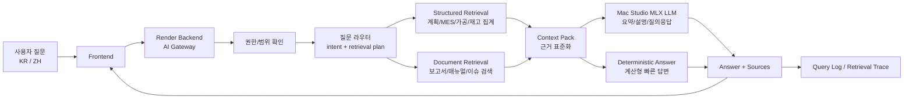

# AI RAG 구축 우선순위 및 데이터 계층 설계

## 목적

WJ DATA CENTER의 AI 기능은 단순 채팅이 아니라 생산 계획, MES 실적, 가공 보고, 재고, 과거 보고서를 근거로 현장 질문에 빠르고 정확하게 답하는 보조 분석 계층이어야 한다.

현재 필요한 RAG는 일반적인 문서 검색형 RAG보다 운영 데이터 RAG에 가깝다. 따라서 LLM이 직접 DB를 추측하게 하지 않고, 별도의 검색/집계 계층이 필요한 데이터를 먼저 가져온 뒤 LLM은 해석과 설명을 담당한다.

핵심 결론은 다음과 같다.

- 생산 숫자 = SQL/API 조회
- 문서/이력 = RAG 검색
- 판단 기준 = 코드로 계산
- 문장 생성 = LLM
- 출처 표시 = 필수

## 핵심 원칙

- LLM은 계산기가 아니라 설명자다. 수량, 진행률, C/T, 가동률, 계획 대비 차이는 백엔드에서 결정적으로 계산한다.
- 검색과 집계는 LLM 호출 전에 끝낸다. LLM에는 질문과 관련된 작은 근거 패키지만 전달한다.
- 모든 답변에는 근거가 있어야 한다. 날짜, 설비, Part No, 계획 수량, MES 실적, 조회 범위를 함께 남긴다.
- 권한은 검색 전에 적용한다. 사용자가 볼 수 없는 계획/공정/보고서는 RAG 컨텍스트에도 들어가면 안 된다.
- 프런트엔드가 맥스튜디오 LLM에 직접 붙지 않는다. 운영에서는 Render 백엔드가 인증된 AI Gateway 역할을 하고, 맥스튜디오는 내부 AI Worker로 둔다.
- 로컬 LLM 장애 시에도 계산형 답변은 계속 가능해야 한다. LLM 실패는 답변 품질 저하이지 서비스 중단이 아니어야 한다.

## AI 기능 단계

AI 기능은 한 번에 "RAG 챗봇"으로 만들지 않고 3개 단계로 나눈다.

### 1단계. 대시보드 AI 요약

기준일 생산 대시보드의 상단 카드와 실시간 프로그레스 데이터를 바탕으로 자동 브리핑을 만든다.

예시 답변:

```text
기준일 2026-05-14 사출 완료율은 23.5%이며, 현재 생산시간 기준 기대치보다 12.4%p 낮습니다.
가공 완료율은 1.8%로 낮고, 실적 발생 라인은 2개입니다.
우선 확인 대상은 계획 대비 실적 차이가 큰 850T-1, 650T-10, D LINE입니다.
```

이 단계는 RAG보다 DB/API 기반 요약이다. 날짜, 사출 실적, 계획, 시간 기준, 가동 설비 수, Part별 부족 수량은 백엔드가 계산한다. LLM은 계산된 facts를 보고 보고용 문장으로 바꾼다.

### 2단계. 현재 화면 기준 질문하기

사용자가 현재 대시보드를 보면서 질문할 수 있게 한다.

대표 질문:

- 오늘 사출이 왜 빨간색이야?
- 850T-1에서 어떤 Part가 가장 밀렸어?
- 가공 실적이 낮은 라인은 어디야?
- 기준일 08:00~익일 08:00 기준으로 부족 수량 큰 순서로 보여줘.
- 이 내용을 팀장 보고용으로 5줄 요약해줘.

이 단계의 핵심도 구조화된 생산 데이터 조회다. LLM이 직접 DB를 뒤지는 것이 아니라, 백엔드의 안전한 조회 함수 결과만 보고 답한다.

권장 조회 함수:

- `getDailyProductionSummary(date)`
- `getInjectionSummary(date)`
- `getMachiningSummary(date)`
- `getMachinePartProgress(date, machine_id)`
- `getPartProgress(date, part_no)`
- `getUnderperformingItems(date)`
- `getMachineIdleWindows(date, machine_id)`

### 3단계. 문서/이력 RAG

운영 숫자만으로 답하기 어려운 질문에 붙인다.

대표 질문:

- 850T-1 사출량이 급감할 때 점검해야 할 항목은?
- 이 Part No의 과거 불량 이력은?
- 금형 교체 후 생산량이 안 나올 때 표준 조치 방법은?
- 이 모델의 작업표준서 기준 검사 포인트는?
- 비슷한 지연 사례가 과거에 있었어?

검색 대상은 생산 실적 숫자 자체가 아니라 작업표준서, 설비 매뉴얼, 금형 이력, 불량 조치 이력, 생산 일지, 회의록, 과거 보고서다.

## 목표 아키텍처



## RAG 데이터 계층

### 1. Structured Retrieval

운영 DB에서 정확히 계산해야 하는 데이터다. 우선순위가 가장 높다.

- 생산 계획: 기준일, 공정, 설비/라인, 순서, Part No, 모델, Lot, 계획 수량, Cavity, 제품군(B/C, C/A, G/P), 완제품 여부.
- MES 사출 실적: 기준일 08:00 ~ 익일 08:00 형합수, 최근 60분 형합수, C/T, 오일온도, 전력 사용량.
- 가공 실적: MES 생산완료 보고 기준의 생산 수량, 계획 대비 차이, 라인별 실적.
- 설비 상태: 최근 60분 가동 여부, 기준일 가동 여부, 계획은 있으나 실적이 없는 설비.
- 계획 대비 리스크: 시간 진행률 대비 생산 진행률, 부족 수량, 미시작 작업, 현재 진행 Part.

Structured Retrieval은 벡터 검색 대상이 아니다. 기준일, 설비, Part No, 모델, 제품군, 공정 조건으로 SQL/API에서 정확히 조회한다.

### 2. Document Retrieval

정성 정보나 과거 사례를 찾기 위한 데이터다. Structured Retrieval 이후에 붙인다.

- 일일 생산 브리핑 저장본.
- 작업자 이슈 메모와 정지 사유.
- 금형/설비 문제 이력.
- 품질 불량 보고.
- 업무 매뉴얼, 공정 기준, 용어 사전.
- 과거 회의록 또는 분석 보고서.

Document Retrieval은 metadata filter와 semantic search를 같이 사용한다. 예를 들어 "850T-1 오늘 생산이 왜 밀렸는지 관련 이력 찾아줘"라는 질문은 먼저 `date=2026-05-14`, `machine=850T-1`, `process=injection`, `intent=delay_analysis`로 필터를 만든 뒤 문서 검색을 수행한다.

### 3. Context Pack

LLM에 넘기는 최종 근거 묶음이다. 토큰을 줄이고 답변 품질을 높이기 위해 항상 같은 형식으로 만든다.

```json
{
  "question": "오늘 생산 진도 어때?",
  "language": "ko",
  "scope": {
    "business_date": "2026-05-14",
    "range": "2026-05-14 08:00 ~ 2026-05-15 08:00",
    "processes": ["injection", "machining"]
  },
  "facts": [
    {
      "type": "production_progress",
      "process": "injection",
      "actual_qty": 5153,
      "planned_qty": 16347,
      "progress_rate": 31.5,
      "source": "ProductionPlan + InjectionMonitoringRecord"
    }
  ],
  "tables": [
    {
      "name": "machine_progress_top_gap",
      "columns": ["machine", "part_no", "model", "estimated_qty", "planned_qty", "gap_qty", "recent_ct_sec"],
      "rows": []
    }
  ],
  "retrieval_trace": [
    "production.plan_summary:2026-05-14",
    "mes.injection_matrix:2026-05-14",
    "production.cavity_map"
  ]
}
```

## 우선순위

### P0. 운영 안전장치

먼저 해야 한다. 이게 없으면 RAG를 붙일수록 위험해진다.

- 프런트엔드에서 맥스튜디오 LLM을 직접 호출하지 않도록 운영 구조를 분리한다.
- Render 백엔드에 AI Gateway endpoint를 둔다.
- Mac Studio AI Worker는 VPN, Tailscale, Cloudflare Tunnel, 사내망 중 하나로 백엔드에서만 접근한다.
- API Key 또는 서명 토큰으로 AI Worker 호출을 보호한다.
- 질문/응답/검색 근거 로그를 저장한다.

### P1. 계산형 RAG

가장 먼저 사용자 경험이 좋아지는 구간이다. 벡터 DB 없이도 가능하다.

- 질문 라우터가 필요한 데이터 도구를 고른다.
- 백엔드가 생산 계획, MES, Cavity, 제품군, 가공 보고를 집계한다.
- LLM은 최종 facts를 읽고 한국어/중국어로 설명한다.
- LLM 실패 시에도 백엔드 계산 답변을 반환한다.

대표 질문:

- 오늘 생산 진도 어때?
- 지금 생산 중인 사출기는 몇 대야?
- 계획 대비 가장 부족한 사출기는 어디야?
- 850T-1은 지금 어떤 Part를 생산 중이야?
- 백커버 생산 중 C/T가 가장 긴 설비는?
- 24G411 오늘 얼마나 생산됐어?
- 今天注塑进度怎么样？
- 哪台注塑机计划差异最大？
- 现在生产 B/C 的设备中哪台节拍最慢？

### P2. 근거 표시와 신뢰도

AI 답변을 보고서로 쓰려면 사용자가 근거를 확인할 수 있어야 한다.

- 답변 아래에 "사용한 데이터" 접힘 영역을 둔다.
- 기준일, 조회 범위, 설비, Part No, 계산식, 마지막 MES 갱신 시간을 표시한다.
- 답변마다 source를 저장한다: `deterministic`, `structured_rag`, `document_rag`, `hybrid_rag`.
- 불확실한 경우 "확인 필요"를 명시한다.

### P3. 문서 RAG

운영 데이터만으로 답하기 어려운 질문을 처리한다.

- 이슈 메모, 생산 브리핑, 품질 보고, 설비 정지 이력을 chunk로 저장한다.
- Part No, 모델, 설비, 날짜, 공정, 제품군을 metadata로 붙인다.
- 한국어/중국어/영문/중문 품번이 섞이므로 metadata 필터 + vector search를 같이 쓴다.
- 답변에는 관련 보고서 제목과 날짜를 함께 제시한다.

문서 chunk는 문장만 저장하지 않는다. 아래 metadata를 필수로 붙인다.

```json
{
  "doc_type": "work_instruction",
  "process": "injection",
  "machine": "850T-1",
  "model": "ABC-123",
  "part_no": "P-10025",
  "business_date": "2026-05-14",
  "title": "850T 계열 사출 작업표준서",
  "content": "..."
}
```

대표 질문:

- 이 모델이 전에 불량 난 적 있어?
- 9호기에서 비슷하게 멈춘 기록이 있었나?
- Back cover 생산 지연 원인이 과거에도 있었나?
- 今天这个型号以前有没有异常记录？

### P4. 사전 질문 세트와 평가

별도 학습보다 먼저 해야 할 일이다.

- 실제 현장 질문 100~200개를 한국어/중국어로 만든다.
- 각 질문에 기대 intent, 필요한 데이터 도구, 정답 형태를 붙인다.
- 배포 전 자동 테스트로 돌려서 intent와 계산 결과가 깨지는지 확인한다.
- 실패 질문은 모델 학습이 아니라 retrieval/tool schema 개선으로 먼저 해결한다.

초기 질문 세트는 의도별로 균형 있게 만든다.

- `summary`: 오늘 생산 진도, 전체 상황, 팀장 보고용 요약.
- `gap`: 계획 대비 부족, 지연 설비, 부족 Part.
- `machine`: 특정 설비 상태, 현재 생산 Part, 최근 60분 C/T.
- `part`: 특정 Part/모델 생산량, 계획 대비 진행률.
- `status`: 가동/정지/미시작 설비.
- `document`: 과거 이력, 조치 방법, 표준서 검색.
- `report`: 5줄 요약, 보고서 문장 생성, 중국어 번역.

## RAG 스택 선택

### 선택지 A. PostgreSQL + pgvector

이미 운영 DB가 PostgreSQL이므로 가장 단순한 시작점이다.

장점:

- 별도 벡터 DB 서버 운영 부담이 작다.
- 문서 metadata와 업무 DB를 같은 PostgreSQL에서 관리할 수 있다.
- PoC와 초기 운영에 충분하다.

주의:

- embedding 차원과 pgvector 타입/인덱스 제약을 배포 환경에서 확인해야 한다.
- 문서량이 커지고 필터 검색이 많아지면 인덱스 설계가 중요해진다.

권장 사용 시점:

- 초기 문서 수가 많지 않고, 운영 부담을 최소화하고 싶을 때.
- Render PostgreSQL에서 확장 설치가 가능한지 확인된 경우.

### 선택지 B. Qdrant

문서량이 많고 metadata filter가 중요해질 때 검토한다.

장점:

- 벡터와 payload metadata를 함께 다루기 좋다.
- 설비, 공정, Part No, 날짜 같은 조건 검색을 분리하기 쉽다.
- Mac Studio 또는 별도 서버에서 독립적으로 운영할 수 있다.

주의:

- 별도 서비스 운영, 백업, 모니터링이 필요하다.
- Mac Studio 로컬 운영 시 Render 백엔드와의 보안 연결 방식을 먼저 정해야 한다.

권장 사용 시점:

- 작업표준서, 일지, 불량 보고, 회의록이 크게 늘어날 때.
- pgvector로 검색 속도나 필터 성능이 부족해질 때.

### 선택지 C. 외부 File Search/API

외부 API 사용이 정책상 가능할 때 빠른 검증용으로만 검토한다.

장점:

- 빠르게 RAG UX를 검증할 수 있다.
- 문서 업로드와 검색 파이프라인 구현 부담이 작다.

주의:

- 회사 내부 문서와 생산 데이터를 외부로 보낼 수 있는지 정책 검토가 먼저다.
- 운영 비용과 데이터 보관 정책을 확인해야 한다.

## Embedding 전략

초기에는 답변 생성 모델보다 embedding 품질과 metadata 설계가 더 중요하다.

권장 순서:

1. pgvector 또는 Qdrant로 검색 계층을 먼저 만든다.
2. 외부 API 사용 가능 여부를 확인한다.
3. 가능하면 안정적인 embedding API로 PoC를 빠르게 만든다.
4. 외부 API가 어렵거나 정책상 제한되면 Mac Studio에서 로컬 embedding 모델을 운영한다.
5. 검색 품질이 부족할 때 reranker를 추가한다.

운영 기준:

- 생산 계획, MES 실적, Cavity, 진행률은 embedding하지 않는다.
- 작업표준서, 조치 이력, 이슈 메모, 보고서, 회의록만 embedding한다.
- chunk에는 항상 `doc_type`, `process`, `machine`, `part_no`, `model`, `business_date`, `source_url/source_id`를 붙인다.
- 질문에서 추출한 metadata filter를 먼저 적용하고, 그 결과 안에서 vector search를 수행한다.

## 권장 DB/코드 구조

### 신규 테이블 후보

- `ai_query_log`: 사용자, 질문, 언어, 기준일, 답변, source, latency, 성공/실패.
- `ai_retrieval_trace`: query log별 사용한 데이터셋, 필터, row count, 기준 시간.
- `ai_context_snapshot`: LLM에 전달한 context pack의 축약본.
- `ai_document`: 보고서/메모/매뉴얼 원문 메타데이터.
- `ai_document_chunk`: 문서 chunk, embedding, metadata.
- `ai_feedback`: 사용자가 답변이 맞는지/유용한지 평가한 기록.
- `ai_brief_cache`: 기준일/공정별 AI 브리핑 캐시, 생성 기준 데이터 해시, 만료 시간.

### 백엔드 모듈 후보

- `production/ai_gateway.py`: API 진입점, LLM 호출, 응답 조립.
- `production/ai_router.py`: 질문 의도와 retrieval plan 생성.
- `production/ai_retrievers.py`: 생산 계획/MES/가공/재고 검색 도구.
- `production/ai_context.py`: context pack 생성과 토큰 축약.
- `production/ai_answer.py`: deterministic 답변과 LLM 프롬프트.
- `production/ai_eval.py`: 질문 세트 기반 회귀 테스트.

## 1차 구현 범위

바로 구현할 첫 단계는 P1 계산형 RAG다.

- `POST /api/production/ai/ask/`는 유지하되 내부를 retrieval pipeline으로 정리한다.
- 질문 라우터는 LLM + heuristic fallback을 같이 사용한다.
- 답변 전에 항상 `context_pack`을 만든다.
- 우선 지원 intent:
  - `production_summary`: 생산 진도/오늘 상황.
  - `production_output`: 특정 Part/모델/제품군 생산량.
  - `machine_detail`: 특정 설비 현재 상태.
  - `plan_gap`: 계획 대비 부족 설비/Part.
  - `injection_cycle_time`: C/T, 느린/빠른 설비.
  - `production_status`: 가동/정지/미시작 설비.
  - `risk_analysis`: 먼저 확인할 설비/작업.
- 프런트엔드 답변 영역에는 답변, 사용 데이터, 계산 기준을 분리해서 표시한다.

### P1 MVP 경계

첫 구현은 "AI 브리핑 v1"로 제한한다.

포함한다:

- `GET /api/production/ai/briefing/`
- 기준일 08:00 ~ 익일 08:00 범위 계산
- 사출 계획/실적/완료율/시간 기준 진행률
- 가공 계획/실적/완료율
- 계획 대비 부족 설비/라인 TOP
- 사용 데이터와 계산 기준 반환
- LLM 없이 deterministic answer 반환
- 프런트엔드에서 실패 시 화면 데이터 기반 브리핑으로 fallback

포함하지 않는다:

- 문서 RAG
- 벡터 DB
- 자유 질문 라우터 고도화
- LLM rewrite 필수화
- risk analysis 정교화
- DB 기반 AI 캐시 테이블

초기 파일 경계:

- `ai_types.py`: 응답과 context pack schema
- `ai_metrics.py`: 완료율, 시간 진행률, 지연 판단 계산
- `ai_retrievers.py`: 생산 계획/MES/가공 실적 조회
- `ai_context.py`: facts, tables, used data, calculation basis 조립
- `ai_answer.py`: deterministic briefing 생성

## 프런트엔드 적용 방식

### A. AI 브리핑 카드

생산 대시보드 상단 카드 아래에 기준일 AI 브리핑을 둔다.

- 페이지 로드마다 LLM을 호출하지 않는다.
- 기준일/공정/데이터 갱신 시간 기준으로 5~10분 캐싱한다.
- 숫자와 판단은 백엔드 계산값만 사용한다.
- LLM은 보고 문장 다듬기만 수행한다.

### B. 설비별 AI 분석 칩

사출기 상세 버튼 옆에 `AI 분석` 칩을 둔다.

예시 자동 질문:

```text
850T-1의 오늘 계획 대비 지연 Part를 요약하고, 관련 조치 이력이 있으면 같이 보여줘.
```

이때 컨텍스트는 전체 대시보드가 아니라 해당 설비의 기준일 계획/실적/이슈 이력으로 제한한다.

### C. 우측 슬라이드 AI 패널

모달보다 우측 패널이 적합하다. 사용자가 대시보드를 보면서 질문할 수 있어야 한다.

패널 기본 정보:

- 기준일
- 공정
- 선택 설비
- 선택 Part No
- 조회 범위

추천 질문:

- 이 설비의 지연 원인은?
- Part별 부족 수량 큰 순서로 보여줘.
- 팀장 보고용으로 요약해줘.
- 관련 작업표준서 찾아줘.

## 피해야 할 방식

아래 방식은 성능과 정확도 모두 불안정하다.

- 프런트에서 모든 생산 데이터를 문자열로 합쳐 LLM에 통째로 전달한다.
- LLM에게 숫자 계산을 맡긴다.
- LLM에게 자유 SQL을 생성하게 한다.
- 권한 확인 전에 RAG 검색을 수행한다.
- 검색 근거 없이 원인 후보를 단정한다.
- 답변에 기준일, 조회 범위, 데이터 출처를 표시하지 않는다.

대신 아래 규칙을 지킨다.

- 생산 데이터는 허용된 조회 함수만 사용한다.
- 문서 RAG는 metadata filter 후 vector search를 수행한다.
- LLM에는 작고 검증된 context pack만 전달한다.
- 답변에는 항상 근거와 불확실성을 구분한다.

## 성능 개선 우선순위

응답 속도가 느릴 때는 모델을 키우기 전에 아래 순서로 개선한다.

1. 페이지 로드 시 LLM 호출을 없애고 기준일별 브리핑 캐시를 사용한다.
2. 완료율, 시간 기준 대비 차이, 부족 수량, 설비 수는 코드에서 계산한다.
3. 문서 검색 top-k를 작게 유지하고, 필요하면 rerank 후 3~5개만 LLM에 전달한다.
4. 생산 실적/계획은 vector search 대상에서 제외한다.
5. 답변 길이를 현장용으로 제한한다: 5줄 요약, 원인 후보 3개, 확인 항목 3개.
6. 같은 질문/같은 기준일/같은 데이터 해시의 답변은 캐싱한다.

## MVP 일정

### 1주차. AI 브리핑

RAG 없이 시작한다.

입력:

- 기준일
- 사출 실적/계획
- 가공 실적/계획
- 시간 기준 진행률
- 설비별 진행률
- Part별 부족 수량

출력:

- 오늘 요약
- 지연 여부
- 우선 확인 설비
- 보고용 문장

### 2주차. 질문형 생산 분석

백엔드에 안전한 data tool을 만든다.

- `getDailyProductionSummary(date)`
- `getInjectionSummary(date)`
- `getMachiningSummary(date)`
- `getMachineDetail(date, machine_id)`
- `getPartProgress(date, part_no)`
- `getUnderperformingMachines(date)`

LLM은 이 함수 결과만 보고 답한다.

### 3주차. 문서 RAG

작업표준서, 설비 매뉴얼, 불량 조치 이력부터 넣는다.

RAG 대상 우선순위:

1. 설비별 작업표준서
2. 금형/설비 조치 이력
3. 불량 발생 및 대책서
4. 일일 생산 회의록
5. 과거 보고서

### 4주차. AI 보고서 생성

기준일을 선택하면 보고서 초안을 생성한다.

- 금일 생산 요약
- 사출 계획 대비 실적
- 가공 계획 대비 실적
- 지연 설비 TOP 5
- Part별 부족 수량 TOP 5
- 원인 후보
- 조치 필요 항목
- 내일 확인 사항.

## Mac Studio 운영 방식

운영 배포 후 직원 PC가 직접 맥스튜디오에 붙는 구조는 피한다.

권장 흐름:

1. 직원 브라우저는 Render 프런트엔드에 접속한다.
2. 프런트엔드는 Render 백엔드 `/api/production/ai/ask/`만 호출한다.
3. Render 백엔드는 DB에서 필요한 데이터를 검색/집계한다.
4. Render 백엔드가 보안 터널을 통해 Mac Studio AI Worker에 context pack을 전달한다.
5. Mac Studio는 MLX LLM 답변만 생성해서 백엔드에 반환한다.
6. 백엔드는 답변과 근거를 저장하고 프런트엔드에 반환한다.

이 구조가 좋은 이유:

- 직원 PC에서 맥스튜디오 IP와 포트를 알 필요가 없다.
- 권한 처리를 한 곳에서 할 수 있다.
- LLM 장애 시 백엔드가 계산형 답변으로 fallback할 수 있다.
- 나중에 Mac Studio를 더 큰 모델이나 별도 추론 서버로 바꿔도 프런트엔드는 그대로 둔다.

## 학습이 필요한가?

초기에는 별도 학습보다 RAG와 평가 세트가 먼저다.

- 현재 문제는 모델이 회사 지식을 모르는 것보다, 어떤 데이터를 어디서 가져와야 하는지 모르는 문제가 더 크다.
- 제품군, Cavity, 기준일 08:00 컷오프, 사출 순서 배분 같은 규칙은 학습보다 코드와 context pack에 명시하는 편이 정확하다.
- 충분한 질문 로그와 정답 데이터가 쌓인 뒤에야 fine-tuning 또는 adapter 학습을 검토한다.

## 다음 액션

1. `ai_retrievers.py`와 `ai_context.py`를 분리해 structured RAG 파이프라인을 만든다.
2. 생산 대시보드 질문창은 `/api/production/ai/ask/`만 호출하도록 정리한다.
3. 답변 아래에 사용 근거와 조회 범위를 표시한다.
4. 한국어/중국어 질문 세트 50개를 먼저 만들어 회귀 테스트에 넣는다.
5. Mac Studio AI Worker는 보안 터널 전제로 운영 방식을 정한다.
