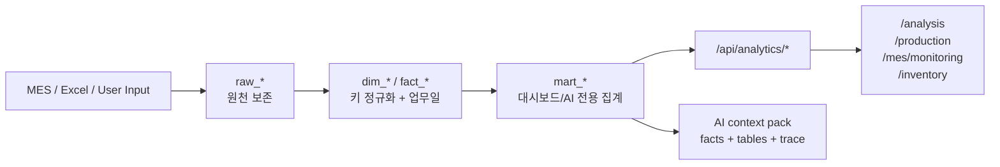

# 분석 저장 계층 및 시각화 설계

## 1. 목적

이 문서는 현재 `wj_reporting`의 생산 계획, MES, 재고, 품질, AI 브리핑 흐름을 기준으로 분석용 데이터를 어떻게 저장하고, 어떤 화면으로 보여줄지 정의한다.

핵심 목표는 아래와 같다.

1. 운영 테이블을 직접 흔들지 않고 분석 계층을 옆에 둔다.
2. 대시보드 계산식, AI 브리핑, 분석 화면이 같은 기준 데이터를 읽게 한다.
3. 단순 차트 모음이 아니라 지연, 누락, 품질, 재고 리스크를 먼저 보여주는 운영 분석 구조로 만든다.
4. 디자인, 데이터 흐름, 데이터 분석 에이전트가 같은 계약을 검토할 수 있게 한다.

기준 파일:

- [backend/production/models.py](/Users/ssoe94/reporting_v2/wj_reporting/backend/production/models.py:4)
- [backend/production/ai_retrievers.py](/Users/ssoe94/reporting_v2/wj_reporting/backend/production/ai_retrievers.py:62)
- [backend/production/ai_context.py](/Users/ssoe94/reporting_v2/wj_reporting/backend/production/ai_context.py:76)
- [backend/injection/models.py](/Users/ssoe94/reporting_v2/wj_reporting/backend/injection/models.py:473)
- [backend/inventory/models.py](/Users/ssoe94/reporting_v2/wj_reporting/backend/inventory/models.py:71)
- [frontend-next/src/domains/analysis/pages/AnalysisPage.tsx](/Users/ssoe94/reporting_v2/wj_reporting/frontend-next/src/domains/analysis/pages/AnalysisPage.tsx:1)
- [frontend-next/src/domains/production/pages/ProductionDashboardPage.tsx](/Users/ssoe94/reporting_v2/wj_reporting/frontend-next/src/domains/production/pages/ProductionDashboardPage.tsx:964)
- [frontend-next/src/domains/mes/pages/MesMonitoringPage.tsx](/Users/ssoe94/reporting_v2/wj_reporting/frontend-next/src/domains/mes/pages/MesMonitoringPage.tsx:1077)

## 2. 에이전트 운용 방식

분석 기능은 한 에이전트에게 "다 봐줘"라고 맡기면 산출물이 흐려진다. 아래처럼 역할을 나눠야 한다.

| 에이전트 | 확인 대상 | 산출물 |
| --- | --- | --- |
| Data-flow architect | 원천 테이블, 배치, 동기화, 키, 보존 기간 | `raw -> fact -> mart` 저장 설계 |
| Analytics engineer | 계산식, 지표, 예외 감지, 품질 게이트 | 지표 정의, DQ 규칙, 백필 순서 |
| Visualization designer | 화면 구조, 차트/테이블, 드릴다운, 반응형 | 분석 화면 계약과 UX 우선순위 |
| Browser QA agent | 실제 화면, 콘솔, 네트워크, 레이아웃 | 화면별 합격 기준과 증거 |
| Worker agent | 합의된 한 조각 구현 | 마이그레이션/API/프런트 패치 |

운용 원칙:

- 데이터 흐름 에이전트는 코드를 수정하지 않고 원천/키/보존 정책을 찾는다.
- 시각화 에이전트는 기존 컴포넌트와 화면 패턴을 우선 사용한다.
- 분석 에이전트는 "현재 계산 가능한 지표"와 "저장하지 않으면 잃는 지표"를 분리한다.
- Worker agent는 설계가 합의된 후 하나의 쓰기 범위만 맡긴다.

## 3. 현재 상태 판단

현재 시스템은 분석 기반이 이미 일부 있다.

| 영역 | 현재 기준 데이터 | 판단 |
| --- | --- | --- |
| 생산 계획 | `ProductionPlan`, `ProductionPlanChangeLog` | 계획/변경 이력 분석 가능 |
| 생산 실행 | `ProductionExecution` | 현장 입력 기반 실적/불량/CT 분석 가능 |
| 사출 MES | `InjectionMonitoringRecord` | 설비별 누적 카운터, 온도, 전력 분석 가능 |
| 가공 MES | `ProductionMesReportRecord` | 생산완료 보고와 계획 매칭 가능 |
| 재고 | `StagingInventory`, `FactInventory`, `DailyInventorySnapshot` | 현재고/일일 스냅샷 분석 가능 |
| 완성품 입출고 | `FinishedGoodsTransactionSnapshot`, `FinishedGoodsTransaction` | 08:00/20:00 구간 입출고 분석 가능 |
| 품질 | `QualityReport`, `AssemblyReport`, `DefectHistory` | 품질/불량 이력 분석 가능하지만 정규화 부족 |
| AI | `AiJob`, `build_context_pack` | 근거 기반 브리핑 가능 |

하지만 분석용 저장 관점에서는 다음 문제가 있다.

- 같은 생산 진행률 계산이 `ProductionStatusView`, `ProductionDashboardView`, `ai_retrievers`, `ai_gateway`에 나뉘어 있다.
- 재고 스냅샷은 10일 또는 30일 기준으로 삭제되는 경로가 있어 월간/분기/계절 분석에 부족하다.
- 사출 MES minute 데이터는 압축되어 단기 장애, 미세 정지, CT 이상 추적에 약하다.
- 품질 `defect_rate`는 문자열이라 분석 지표로 직접 쓰기 어렵다.
- plan-only, MES-only, 지연, 품질 NG, 재고 급변 같은 예외가 화면마다 흩어져 있고 통합 이벤트로 저장되지 않는다.

## 4. 핵심 결정

운영 테이블을 바로 갈아엎지 않는다. 대신 분석 전용 계층을 추가한다.



이 구조의 장점:

- 운영 입력/업로드 흐름을 깨지 않는다.
- 분석과 AI가 같은 mart를 읽는다.
- 원천 재처리와 백필이 가능하다.
- 화면 계산식이 줄어들고 테스트가 쉬워진다.

## 5. 저장 계층

## 5.1 Raw Layer

원천 보존 계층이다. 삭제/수정 대신 append 또는 source id 기준 upsert만 허용한다.

| 후보 테이블 | Grain | 저장 이유 |
| --- | --- | --- |
| `raw_production_plan_upload` | 업로드 파일 + 파싱 행 | 현재 업로드는 기존 계획을 삭제 후 재생성하므로 원본 비교가 필요 |
| `raw_mes_resource_monitor` | `device_code + parameter + record_time` | 사출 MES 원천 재처리, 카운터 리셋 검증 |
| `raw_mes_progress_report` | `report_record_detail_id` | 가공 MES 완료 보고 원천 보존 |
| `raw_inventory_current_pull` | `fetch_batch_id + composite_key` | MES 재고 pull 성공/실패와 이전 pull 비교 |
| `raw_inventory_change_log` | `source_change_id` 또는 payload hash | 완성품 입출고 원천 이력 |
| `raw_quality_report_payload` | 품질 보고 id 또는 외부 문서 id | 이미지/판정/현상 텍스트 원천 추적 |

필수 공통 필드:

- `source_system`
- `source_record_id`
- `source_payload`
- `ingested_at`
- `ingestion_batch_id`
- `payload_hash`
- `is_valid`
- `validation_errors`

## 5.2 Dimension and Fact Layer

분석 키를 맞추는 계층이다. 모든 fact는 가능한 한 `business_date`, `process`, `equipment_key`, `part_no`를 가진다.

| 테이블 | Grain | 주요 필드 |
| --- | --- | --- |
| `dim_part` | `part_no` | 모델, 제품군, 완제품 여부, cavity, CT, 중량, active 여부 |
| `dim_equipment` | `process + equipment_key` | 표시명, 사출기 번호, 라인, tonnage, active 여부 |
| `fact_plan_line` | `business_date + process + equipment_key + part_no + lot_no + sequence` | 계획 수량, 모델, 제품군, 원본 plan id |
| `fact_production_execution` | plan line key | 실제 수량, 불량, idle, 인원, CT, 상태 |
| `fact_injection_monitor_slot` | `timestamp_slot + equipment_key` | 누적 shot, shot delta, 온도, 전력, reset flag |
| `fact_mes_completion` | `business_date + process + equipment_key + part_no + report_detail_id` | MES 보고 수량, 보고 시간, 원천 payload |
| `fact_machining_manual_report` | `business_date + plan_date + equipment_key + part_no + manual_report_id` | MES 누락 보정 수량, 불량 상세, 대사 상태 |
| `fact_machining_manual_match` | `manual_report_id + mes_report_record_id` | 수기 보정과 MES 후등록 보고의 매칭 수량 |
| `fact_inventory_position` | `material_code + warehouse + qc_status + label/composite_key` | 현재고, 단위, MES 갱신 시각, batch |
| `fact_inventory_snapshot` | `snapshot_date + material_code + warehouse + qc_status` | 08:00 재고, 대차 수, 품목 수 |
| `fact_finished_goods_movement` | `report_date + slot + material_code + warehouse` | 입고, 출고, 순변동, 마지막 입출고 시각 |
| `fact_quality_event` | 품질 보고 id | 모델, part, lot, 검사수, 불량수, 판정, 현상, 조치 |
| `fact_exception_event` | exception id | 유형, 심각도, source, 상태, 담당자, 발생/해결 시각 |

## 5.3 Mart Layer

화면과 AI가 직접 읽는 계층이다. mart는 계산 결과를 저장하되, 원천 row count와 계산 기준을 같이 보관해야 한다.

| Mart | Grain | 사용 화면 |
| --- | --- | --- |
| `mart_production_daily_progress` | `business_date + process` | `/analysis`, `/production` KPI |
| `mart_equipment_daily_progress` | `business_date + process + equipment_key` | 생산 설비/라인 progress |
| `mart_part_daily_progress` | `business_date + process + equipment_key + part_no + sequence` | 상세 모달, part drilldown |
| `mart_equipment_signal_hourly` | `business_date + equipment_key + hour_slot` | MES 추이, 온도/전력/CT |
| `mart_inventory_daily_balance` | `snapshot_date + material_code + warehouse + qc_status` | 재고 분석 |
| `mart_finished_goods_slot_flow` | `report_date + slot + material_code` | 완성품 입출고 |
| `mart_quality_daily_defect` | `business_date + section + model + part_no + phenomenon` | 품질 추이 |
| `mart_exception_summary` | `business_date + process + exception_type` | 예외 센터 |
| `mart_analysis_context` | `business_date + scope_hash` | AI context pack 캐시 |

`mart_analysis_context`는 [backend/production/ai_context.py](/Users/ssoe94/reporting_v2/wj_reporting/backend/production/ai_context.py:76)의 `Context Pack`과 같은 구조를 저장한다.

필수 필드:

- `scope`
- `facts`
- `tables`
- `used_data`
- `calculation_basis`
- `retrieval_trace`
- `source_row_counts`
- `generated_at`
- `expires_at`

## 6. 표준 키와 업무일

분석 계층에서 날짜 필드를 섞으면 안 된다.

| 필드 | 의미 | 사용처 |
| --- | --- | --- |
| `business_date` | 생산 업무일, 08:00~익일 08:00 | 생산, MES, 예외, AI |
| `plan_date` | 계획 업로드 기준일 | 운영 계획 원장 |
| `snapshot_date` | 재고 스냅샷 기준일 | 재고 08:00 snapshot |
| `report_date` | 입출고 보고 구간 일자 | 완성품 flow |
| `event_time` | 실제 이벤트 발생 시각 | 품질, MES, 예외 |

생산/MES 분석은 항상 Asia/Shanghai 기준 `08:00 ~ 익일 08:00`을 쓴다. 이미 [backend/production/ai_metrics.py](/Users/ssoe94/reporting_v2/wj_reporting/backend/production/ai_metrics.py:14)에 이 기준이 들어 있으므로, mart 계산도 이 함수를 기준으로 통일한다.

## 7. Refresh and Retention

| 데이터 | Refresh | Retention 권장 | 비고 |
| --- | --- | --- | --- |
| 생산 계획 | 업로드/수정 직후 | 영구 | raw upload와 change log 보존 |
| 생산 실행 | 입력 직후 | 영구 | 계획 재업로드에도 키로 연결 |
| 사출 MES raw | 1~10분 | 최소 30~90일 원천, 이후 hourly/daily | 짧은 정지/CT 분석용 |
| 사출 hourly mart | 1시간 또는 보강 배치 | 13개월 이상 | 추세/설비 비교용 |
| 가공 MES 완료 보고 | 5분 incremental + 24시간 repair | 영구 | `report_record_detail_id` 기준 |
| 재고 current | MES pull 성공 시 | 최근 successful batch + 감사 로그 | 실패 pull은 publish 금지 |
| 재고 daily snapshot | 매일 08:00 이후 | 13개월 이상 | 현재 10/30일 삭제 정책은 분석용과 분리 |
| 완성품 입출고 | 08:00/20:00 | 13개월 이상 | 구간 흐름 분석 |
| 품질 이벤트 | 입력 직후 | 영구 | numeric defect rate 추가 필요 |
| 예외 이벤트 | mart 계산 직후 | 영구 | 상태/담당자/해결 이력 보존 |
| AI context/output | 질문/브리핑 생성 시 | 3~13개월 | 모델/프롬프트/근거 추적 |

## 8. Data Quality Gates

분석 mart를 만들기 전에 아래 게이트를 통과해야 한다.

| Gate | Fail Condition | 처리 |
| --- | --- | --- |
| Plan key | `business_date/process/equipment_key/part_no/sequence` 누락 | quarantine 또는 warning |
| Positive plan | 계획 수량 0 이하 | 분석 제외 + 업로드 warning |
| Cavity source | 사출 part의 cavity 미지정 | `cavity_source=default_1` 표시 |
| Counter delta | 음수 delta 또는 비정상 reset | reset flag + exception 후보 |
| MES freshness | 기준일 계획은 있으나 MES 최신 시각 없음 | `missing_mes_data` exception |
| Match status | plan-only 또는 MES-only 발생 | `plan_only`, `mes_only` 유지 |
| Inventory publish | MES pull 중단/row count 급감 | current fact publish 금지 |
| Quality numeric | defect rate 문자열만 존재 | numeric 파생값 계산 실패 시 warning |
| Mart freshness | mart 생성 시각이 원천 최신 시각보다 오래됨 | stale 표시 |
| AI evidence | `used_data`, `calculation_basis`, `retrieval_trace` 누락 | AI 응답 노출 금지 |

## 9. 표준 지표

## 9.1 생산

- 계획 수량
- 추정/실제 생산 수량
- 계획 대비 gap
- 진행률
- 시간 기준 진행률
- 지연 여부
- 가동 설비 수
- 최근 60분 shot
- 추정 CT
- part별 완료/진행/대기
- plan-only / MES-only / overrun
- 가공 수기 보정 수량
- 가공 수기-MES 대사 상태
- 선진행 생산 수량

사출의 canonical 계산은 `counter delta + cavity + plan sequence allocation`이다. 이 로직은 [backend/production/ai_retrievers.py](/Users/ssoe94/reporting_v2/wj_reporting/backend/production/ai_retrievers.py:106)의 경로를 기준으로 서비스화한다.

가공의 canonical 계산은 `MES 보고 수량 + 아직 MES로 대체되지 않은 수기 보정 잔량`이다. 세부 기준은 [docs/rebuild/21-machining-mes-first-manual-reconciliation.md](/Users/ssoe94/reporting_v2/wj_reporting/docs/rebuild/21-machining-mes-first-manual-reconciliation.md:1)를 따른다.

## 9.2 MES 설비

- 시간대별 shot delta
- 누적 shot
- 전력 사용량
- 오일온도
- 최근 24시간 가동률
- 날짜별 가동 설비 수
- 이상 온도/전력/정지 구간
- 10분 이상 무생산 기반 금형/코어 교체, 사출조건준비(调机), 조정/비정상 정지 후보

## 9.3 재고

- 현재고
- 전일/전주/전월 대비 증감
- 대차 수
- QC hold 수량
- 완성품 입고/출고/순변동
- 생산 계획 대비 부족 위험
- 장기 체류/저회전 후보

## 9.4 품질

- 검사 수량
- 불량 수량
- numeric defect rate
- 판정별 건수
- 현상별 top N
- model/part/section별 추이
- 과거 유사 품질 이력

## 9.5 AI/분석 신뢰도

- 사용한 데이터 row count
- 마지막 원천 갱신 시각
- mart 생성 시각
- 계산 기준 버전
- AI job 상태
- deterministic/LLM/hybrid source
- 사용자 feedback

## 10. 시각화 설계

## 10.1 `/production`: 당일 운영 cockpit

목적:

- 오늘 기준으로 어디가 늦고, 어느 설비/라인을 먼저 봐야 하는지 보여준다.

구성:

1. KPI strip
   - 기준일
   - 사출 실적/계획
   - 가공 실적/계획
   - 계획 대비 부족
   - 가동 설비 수
2. Exception-first briefing
   - rule/AI 브리핑
   - top risks
   - 사용 데이터
   - 계산 기준
3. Live progress two-column
   - 사출 segmented progress
   - 가공 segmented progress
4. Drilldown modal
   - 설비/라인 요약
   - part/lot/sequence별 진행
   - raw report/change log 링크

기존 [frontend-next/src/domains/production/realtime-progress.ts](/Users/ssoe94/reporting_v2/wj_reporting/frontend-next/src/domains/production/realtime-progress.ts:11)의 segmented progress 구조를 유지한다. 제조 현장에서는 단일 percent bar보다 `완료/진행/대기/초과` segment가 더 유용하다.

## 10.2 `/mes/monitoring`: 설비 health monitor

목적:

- MES 수집 상태와 설비별 생산/전력/온도 흐름을 본다.

구성:

1. Process selector
   - 사출
   - 가공
   - 재고
2. 사출 machine rail
   - 1~17호기 상태
   - 최근 60분 output
   - warning 상태
3. 선택 설비 trend
   - output bar
   - power line
   - oil temperature line
4. utilization modal
   - 날짜 범위
   - active machine count
   - utilization rate
5. 가공 reconciliation table
   - matched
   - plan-only
   - MES-only
   - achievement inline bar

## 10.3 `/analysis`: 해석 전용 화면

목적:

- 입력/배치 실행이 아니라 여러 도메인의 분석 결과를 비교하고, 추세와 예외를 본다.

초기 탭:

| 탭 | 내용 | Primary mart |
| --- | --- | --- |
| Overview | 7/30일 생산 진행, 재고, 품질, 예외 요약 | `mart_production_daily_progress`, `mart_exception_summary` |
| Exceptions | 지연, plan-only, MES-only, 품질 NG, 재고 급변 | `fact_exception_event`, `mart_exception_summary` |
| Production | 공정/설비/part별 진행 추세 | `mart_equipment_daily_progress`, `mart_part_daily_progress` |
| Inventory Risk | 계획 대비 부족, QC hold, 입출고 변동 | `mart_inventory_daily_balance`, `mart_finished_goods_slot_flow` |
| Quality | model/part/현상별 defect 추이 | `mart_quality_daily_defect` |
| AI Evidence | AI 브리핑/질문 이력과 근거 | `mart_analysis_context`, `AiJob` |

`/analysis`는 운영 액션 버튼을 두지 않는다. refresh, upload, snapshot 생성 같은 액션은 각 운영 화면에 둔다.

## 10.4 `/inventory`: 재고 운영 분석

현재 `/inventory`는 기본 조회 수준이다. 다음 구조로 확장한다.

1. Inventory health KPI
   - 총 품목
   - 총 대차
   - QC hold
   - 최근 갱신
2. Shortage by production plan
   - part/material
   - 계획 수요
   - 현재고
   - 부족 수량
3. Warehouse stock bars
   - 창고별 재고 stack
   - QC 상태 stack
4. Finished goods flow
   - 08:00/20:00 입고/출고/순변동
5. Aging/slow-moving table
   - QR/대차 기준 장기 체류

## 11. API 계약 초안

분석 API는 read-only로 시작한다.

| Endpoint | 목적 |
| --- | --- |
| `GET /api/analytics/overview/?date=YYYY-MM-DD&range=7d` | 전체 요약 |
| `GET /api/analytics/production-progress/?date=YYYY-MM-DD` | 공정/설비/part 진행 |
| `GET /api/analytics/equipment-signals/?date=YYYY-MM-DD&equipment_key=1` | 설비 시계열 |
| `GET /api/analytics/exceptions/?date=YYYY-MM-DD&status=open` | 예외 목록 |
| `GET /api/analytics/inventory-risk/?date=YYYY-MM-DD` | 생산계획 대비 재고 위험 |
| `GET /api/analytics/quality-trends/?from=YYYY-MM-DD&to=YYYY-MM-DD` | 품질 추이 |
| `GET /api/analytics/ai-evidence/?date=YYYY-MM-DD` | AI 근거/브리핑 이력 |

공통 응답 필드:

```json
{
  "scope": {
    "business_date": "2026-05-19",
    "range_start": "2026-05-19T08:00:00+08:00",
    "range_end": "2026-05-20T08:00:00+08:00"
  },
  "freshness": {
    "source_latest_at": "2026-05-19T10:20:00+08:00",
    "mart_generated_at": "2026-05-19T10:21:00+08:00",
    "is_stale": false
  },
  "used_data": [],
  "warnings": [],
  "data": {}
}
```

## 12. 구현 순서

## P0. 계산 경로 표준화

1. `production`에 canonical analytics service를 만든다.
2. 사출 진행률은 `counter delta + cavity + sequence allocation`으로 통일한다.
3. `ProductionStatusView`, AI retriever, dashboard API가 같은 service를 읽게 한다.
4. 기존 production contract tests를 service 기준으로 옮긴다.

## P1. 분석 앱/테이블 추가

1. `backend/analytics` 앱을 만든다.
2. `dim_equipment`, `fact_exception_event`, `mart_production_daily_progress`, `mart_equipment_daily_progress`, `mart_part_daily_progress`부터 추가한다.
3. raw layer는 먼저 plan upload와 MES progress report부터 시작한다.
4. inventory retention 정책은 운영 snapshot과 분석 snapshot을 분리한다.

## P2. Mart 생성 command

1. `refresh_analytics_marts --date YYYY-MM-DD --scope production`
2. `refresh_analytics_marts --date YYYY-MM-DD --scope inventory`
3. 원천 최신 시각, row count, warning을 저장한다.
4. 실패 시 기존 mart를 덮어쓰지 않는다.

## P3. `/analysis` 화면 확장

1. Overview 탭
2. Exceptions 탭
3. Production 탭
4. Inventory Risk 탭
5. AI Evidence 탭

첫 화면은 이미 있는 `StatCard`, panel, modal, table 패턴을 사용한다.

## P4. 예외 이벤트 모델

먼저 자동 생성할 예외:

- `production_behind_schedule`
- `plan_only`
- `mes_only`
- `overproduction`
- `missing_mes_data`
- `machining_manual_open`
- `machining_manual_mismatch`
- `machining_advance_production`
- `machining_mes_duplicate_risk`
- `abnormal_power`
- `abnormal_oil_temperature`
- `high_defect_rate`
- `inventory_spike`
- `inventory_shortage_risk`

각 예외는 `open`, `acknowledged`, `resolved`, `ignored` 상태를 가진다.

## P5. AI 관측성

1. AI 답변의 facts, retrieval trace, calculation basis를 분석 저장소에 남긴다.
2. 사용자 feedback을 저장한다.
3. 품질 이미지 분석 job은 worker 구현 전까지 화면에서 노출하지 않는다.
4. AI 답변은 예외 이벤트 id를 참조할 수 있게 한다.

## 13. 검증 기준

| 검증 | 기준 |
| --- | --- |
| 백엔드 | mart 계산 결과가 기존 production contract fixture와 일치 |
| 데이터 품질 | DQ warning이 API 응답에 노출되고 화면에서 확인 가능 |
| 브라우저 | `/analysis`가 console error 0, failed request 0으로 로드 |
| 시각화 | KPI, trend, table, modal 중 하나라도 빈 데이터일 때 깨지지 않음 |
| AI | `used_data`, `calculation_basis`, `retrieval_trace` 없는 답변은 실패 |
| 보존 | 재고/사출 분석 history가 운영 cleanup에 의해 삭제되지 않음 |

## 14. 결론

분석 기능의 다음 단계는 차트를 더 붙이는 것이 아니라, 분석 저장 계층을 먼저 분리하는 것이다.

가장 현실적인 첫 구현은 아래다.

1. production canonical analytics service
2. `mart_production_daily_progress`
3. `mart_equipment_daily_progress`
4. `mart_part_daily_progress`
5. `/analysis` Overview + Exceptions
6. Browser QA 시나리오 추가

이 순서면 현재 운영 대시보드와 AI 브리핑을 망가뜨리지 않으면서, 분석 화면과 장기 데이터 저장을 같이 키울 수 있다.
