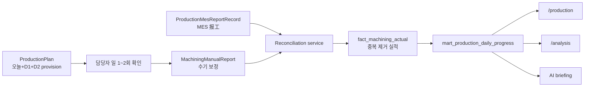
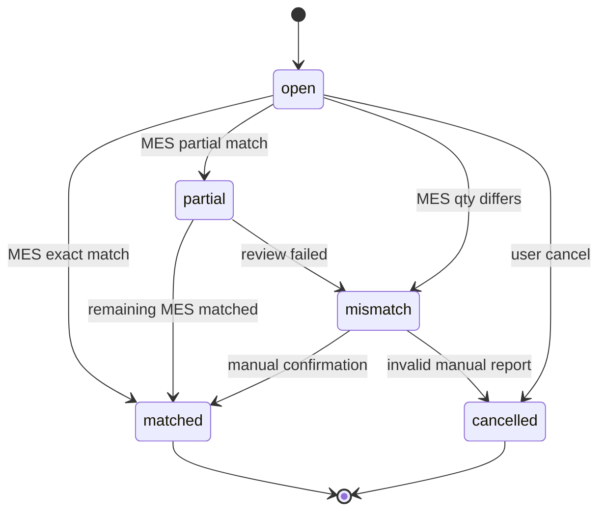

# 가공 MES 우선 수기 보정 및 중복 방지 설계

## 1. 목적

이 문서는 가공 라인의 생산 집계를 `MES 우선`으로 운영하면서, MES에 작업지시 또는 물류 정보가 없어 생산 완료 보고가 누락된 건을 생산 담당자가 하루 1~2회 수기로 보정하고, 이후 MES 보고가 들어왔을 때 이중 계상하지 않도록 하는 기준 설계다.

핵심 목표는 아래와 같다.

1. 기본 생산 실적은 MES `报工` 데이터를 기준으로 한다.
2. 수기 보고는 MES를 대체하는 원장 데이터가 아니라 `누락 보정` 데이터로 둔다.
3. 선진행 생산은 실제 생산일과 원래 계획일을 분리해서 저장한다.
4. 나중에 MES 보고가 들어오면 수기 보정과 대사해서 중복 집계를 막는다.
5. 생산 대시보드, 분석 화면, AI 브리핑이 같은 보정 후 실적을 읽게 한다.

기준 파일:

- [backend/production/models.py](/Users/ssoe94/reporting_v2/wj_reporting/backend/production/models.py:105)
- [backend/production/ai_retrievers.py](/Users/ssoe94/reporting_v2/wj_reporting/backend/production/ai_retrievers.py:241)
- [backend/production/views.py](/Users/ssoe94/reporting_v2/wj_reporting/backend/production/views.py:955)
- [backend/injection/plan_processing.py](/Users/ssoe94/reporting_v2/wj_reporting/backend/injection/plan_processing.py:39)
- [backend/assembly/models.py](/Users/ssoe94/reporting_v2/wj_reporting/backend/assembly/models.py:5)
- [docs/rebuild/15-production-data-contract.md](/Users/ssoe94/reporting_v2/wj_reporting/docs/rebuild/15-production-data-contract.md:1)
- [docs/rebuild/20-analytics-storage-visualization-design.md](/Users/ssoe94/reporting_v2/wj_reporting/docs/rebuild/20-analytics-storage-visualization-design.md:1)

## 2. 운영 원칙

가공 생산 집계의 기준은 아래 순서다.

1. MES 보고가 있으면 MES 수량을 우선한다.
2. MES 보고가 없고 실제 생산이 확인된 경우에만 수기 보정 수량을 임시 실적으로 반영한다.
3. 수기 보정은 항상 원래 계획 row에 연결한다.
4. 수기 보정에는 실제 생산 업무일과 원래 계획일을 모두 남긴다.
5. MES 보고가 나중에 들어오면 수기 보정은 자동 또는 반자동으로 대사된다.
6. 집계는 `MES 수량 + 아직 MES로 대체되지 않은 수기 보정 수량`만 포함한다.

따라서 수기 보고는 "현장 실적 원장"이 아니라 "MES 누락 보정 및 진행 공유 장부"다.

## 3. 문제 시나리오

예시:

1. 2026-05-18 계획이 배포되어 있다.
2. 현장 사정상 2026-05-19 계획 품목을 2026-05-18 업무일에 먼저 생산한다.
3. MES에는 아직 2026-05-19 작업지시 또는 물류 투입이 없어 `报工`를 할 수 없다.
4. 생산 담당자가 2026-05-18 오후 또는 2026-05-19 오전에 시스템에서 수기 보정을 입력한다.
5. 며칠 뒤 MES에 해당 물류가 들어오고 `报工`가 생성된다.
6. 시스템은 같은 생산을 MES와 수기 보정으로 두 번 세면 안 된다.

이 문제를 해결하려면 `plan_date`, `business_date`, `mes_business_date`를 분리해야 한다.

| 필드 | 의미 | 예시 |
| --- | --- | --- |
| `business_date` | 실제 생산한 업무일 | `2026-05-18` |
| `plan_date` | 원래 계획이 걸려 있던 날짜 | `2026-05-19` |
| `mes_business_date` | MES 보고가 실제 들어온 업무일 | `2026-05-20` |

## 4. 권장 데이터 흐름



핵심은 화면이 MES와 수기 보정을 직접 더하지 않는 것이다. 반드시 대사 서비스를 거친 `중복 제거 실적`만 읽어야 한다.

## 5. Provision 화면 설계

가공 담당자가 보는 기준 화면은 `업무일 T`에 대해 아래 범위를 같이 보여준다.

- `T`: 당일 계획
- `T+1`: 다음날 계획
- `T+2`: 다다음날 계획

목적:

- 오늘 계획 중 MES 보고가 정상적으로 들어온 항목 확인
- 오늘 생산했지만 MES 보고가 없는 항목 식별
- 다음날/다다음날 계획 중 선진행한 항목을 빠르게 보정

권장 row 상태:

| 상태 | 의미 | 집계 처리 |
| --- | --- | --- |
| `mes_reported` | MES 보고가 있음 | MES 수량 반영 |
| `manual_open` | 수기 보정만 있음 | 수기 수량 임시 반영 |
| `manual_matched` | 수기 보정이 MES와 대사됨 | MES 또는 대사 수량만 반영 |
| `manual_partial` | MES 일부만 들어옴 | 미대사 잔량만 수기 반영 |
| `manual_mismatch` | 수기와 MES 차이가 큼 | 예외 표시, 승인 필요 |
| `needs_review` | 계획은 있으나 MES/수기 모두 없음 | 미진행 또는 누락 후보 |
| `unplanned_mes` | 계획 없이 MES 보고만 있음 | MES-only 예외 |

필수 필터:

- 라인
- 계획일 범위: 오늘, D+1, D+2
- 상태
- Part No / Model
- 미대사 수기 보정만 보기

## 6. 신규 운영 테이블

초기 구현에서는 기존 `ProductionExecution`에 억지로 넣기보다, 가공 수기 보정 전용 모델을 두는 것이 안전하다. `ProductionExecution`은 계획 row의 현재 입력 상태를 표현하는 성격이 강하고, 여기서는 나중에 MES와 대사해야 하는 감사성 보정 이벤트가 필요하기 때문이다.

권장 모델명:

- `MachiningManualReport`
- `MachiningManualReportDefect`
- `MachiningManualReportMatch`

## 6.1 MachiningManualReport

Grain:

- 수기 보정 1회 입력
- 같은 계획 row라도 수정을 직접 덮어쓰지 말고 correction 또는 cancel 상태를 남긴다.

필드:

| 필드 | 의미 |
| --- | --- |
| `id` | 내부 id |
| `business_date` | 실제 생산 업무일 |
| `plan_date` | 원래 계획일 |
| `plan_type` | `machining` |
| `plan_id` | 가능하면 `ProductionPlan.id` |
| `plan_identity_hash` | 계획 재업로드 후에도 연결할 안정 키 |
| `machine_name` | 계획 라인명 |
| `equipment_key` | 정규화 라인 키 |
| `part_no` | 정규화 Part No |
| `model_name` | 모델명 |
| `lot_no` | lot |
| `sequence` | 계획 순번 |
| `planned_qty_at_report` | 입력 당시 계획 수량 |
| `good_qty` | 양품 수량 |
| `defect_qty` | 불량 수량 합계 |
| `total_reported_qty` | 양품 + 불량 또는 운영 합의 기준 수량 |
| `reason_code` | 수기 보정 사유 |
| `note` | 비고 |
| `status` | `open`, `matched`, `partial`, `mismatch`, `cancelled` |
| `credit_business_date` | 실적 귀속 업무일 |
| `reported_by` | 입력자 |
| `reported_at` | 입력 시각 |
| `updated_by` | 수정자 |
| `updated_at` | 수정 시각 |

`credit_business_date`는 기본적으로 `business_date`와 같다. 나중에 MES가 들어와도 실제 생산일 기준 분석에서는 이 날짜를 유지하는 것을 권장한다. 단, MES 장부 기준 분석은 별도로 `mes_business_date`를 사용한다.

## 6.2 MachiningManualReportDefect

Grain:

- 수기 보정 1건 안의 불량 유형 1개

필드:

| 필드 | 의미 |
| --- | --- |
| `manual_report_id` | 수기 보정 id |
| `defect_category` | `processing`, `outsourcing`, `incoming` 등 |
| `defect_type` | 불량 유형 |
| `quantity` | 수량 |
| `note` | 선택 비고 |

초기에는 JSON으로 시작할 수 있지만, 분석과 Top N 집계를 생각하면 별도 테이블이 낫다. 기존 [backend/assembly/models.py](/Users/ssoe94/reporting_v2/wj_reporting/backend/assembly/models.py:37)의 `processing_defects_dynamic` 구조는 UI 입력 패턴 참고용으로만 본다.

## 6.3 MachiningManualReportMatch

Grain:

- 수기 보정과 MES 보고 record의 매칭 1건

필드:

| 필드 | 의미 |
| --- | --- |
| `manual_report_id` | 수기 보정 id |
| `mes_report_record_id` | `ProductionMesReportRecord.id` |
| `matched_qty` | 이 MES 보고 중 수기 보정을 대체한 수량 |
| `match_confidence` | `exact`, `probable`, `manual_confirmed` |
| `match_reason` | 매칭 근거 |
| `matched_by` | 자동이면 null 또는 system |
| `matched_at` | 매칭 시각 |

이 테이블이 있어야 부분 매칭과 수량 차이를 추적할 수 있다.

## 7. 중복 방지 집계 규칙

가공 실적의 기본 집계식은 아래다.

```text
effective_actual_qty
  = mes_qty_not_reassigned
  + manual_qty_not_matched_by_mes
```

수기 보정별로 보면 아래처럼 계산한다.

```text
manual_effective_qty = max(0, manual_total_reported_qty - matched_mes_qty)
```

계획 row별 최종 실적:

```text
actual_qty_for_progress
  = direct_mes_qty
  + sum(manual_effective_qty)
```

단, 같은 MES 보고가 이미 특정 수기 보정과 매칭되어 `credit_business_date`로 재귀속된 경우에는 이후 다른 날짜의 실제 생산 집계에서 다시 더하지 않는다.

## 8. MES 대사 규칙

대사는 MES sync 직후 또는 주기 command로 수행한다.

권장 command:

```bash
python manage.py reconcile_machining_manual_reports --from-date 2026-05-18 --to-date 2026-05-21
```

매칭 우선순위:

1. `plan_id` 또는 `plan_identity_hash`가 같은 경우
2. `plan_date + equipment_key + part_no + lot_no + sequence`가 같은 경우
3. `plan_date + part_no + lot_no`가 같고 수량 차이가 허용 범위 안인 경우
4. `part_no + model_name + 근접 날짜`가 같아 사람이 확인해야 하는 경우

자동 매칭 허용:

- Part No가 같고
- 계획일이 같거나 provision 범위 안이며
- 수기 보정이 `open`이고
- MES 수량이 수기 수량과 같거나 큰 경우

사람 확인 필요:

- 수량 차이가 큰 경우
- lot가 다르거나 비어 있는 경우
- 같은 Part No의 후보가 여러 개인 경우
- 이미 매칭된 수기 보정이 있는데 추가 MES가 들어온 경우

## 9. 상태 전이



상태 의미:

| 상태 | 의미 | 집계 |
| --- | --- | --- |
| `open` | 아직 MES가 대체하지 않음 | 수기 잔량 반영 |
| `partial` | 일부 MES와 매칭됨 | 수기 잔량만 반영 |
| `matched` | MES가 수기 보정을 대체함 | 중복 반영 금지 |
| `mismatch` | MES와 수기 수량/키가 다름 | 승인 전까지 보수적으로 수기 잔량 반영 또는 제외 |
| `cancelled` | 잘못된 수기 보정 | 반영 안 함 |

초기 운영은 `mismatch`를 실적에서 제외하지 말고, 화면에서 예외로 강하게 표시하는 쪽이 좋다. 생산 진행 공유가 목적이므로 보수적으로 제외하면 현장이 다시 엑셀/메신저로 우회할 가능성이 커진다.

## 10. API 계약

## 10.1 Provision 조회

권장 엔드포인트:

- `GET /api/production/machining/provision/?business_date=2026-05-18&days=3`

응답 핵심:

```json
{
  "business_date": "2026-05-18",
  "range": {
    "plan_date_from": "2026-05-18",
    "plan_date_to": "2026-05-20"
  },
  "summary": {
    "mes_qty": 2710,
    "manual_open_qty": 580,
    "manual_matched_qty": 120,
    "effective_actual_qty": 3290,
    "open_manual_count": 4,
    "mismatch_count": 1
  },
  "rows": []
}
```

Row 필수 필드:

- `business_date`
- `plan_date`
- `day_offset`
- `machine_name`
- `equipment_key`
- `part_no`
- `model_name`
- `lot_no`
- `sequence`
- `planned_qty`
- `mes_qty`
- `manual_qty`
- `matched_manual_qty`
- `effective_actual_qty`
- `status`
- `defect_qty`
- `defect_items`
- `latest_mes_report_time`
- `latest_manual_report_time`

## 10.2 수기 보정 생성

권장 엔드포인트:

- `POST /api/production/machining/manual-reports/`

입력 예시:

```json
{
  "business_date": "2026-05-18",
  "plan_date": "2026-05-19",
  "plan_id": 1234,
  "machine_name": "A LINE",
  "part_no": "ABJ76570714",
  "lot_no": "6F1M02J",
  "sequence": 8,
  "good_qty": 479,
  "defect_qty": 3,
  "defect_items": [
    {"defect_category": "processing", "defect_type": "scratch", "quantity": 2},
    {"defect_category": "processing", "defect_type": "printing", "quantity": 1}
  ],
  "reason_code": "mes_work_order_missing",
  "note": "5/19 계획 선진행, MES 작업지시 미생성"
}
```

검증:

- `plan_type`은 서버에서 `machining`으로 고정한다.
- `plan_id` 또는 계획 키가 반드시 기존 `ProductionPlan`과 매칭되어야 한다.
- `business_date`는 `plan_date`보다 같거나 앞설 수 있다.
- 초기 UI에서는 `business_date` 기준 `T~T+2` 계획만 허용한다.
- 같은 입력자가 같은 계획 row에 같은 수량을 반복 제출하면 idempotency warning을 준다.

## 10.3 대사 큐 조회

권장 엔드포인트:

- `GET /api/production/machining/reconciliation/?business_date=2026-05-18&status=open,mismatch`

목적:

- 생산 담당자 또는 관리자가 미대사/불일치 수기 보정을 확인한다.
- 자동 매칭이 애매한 후보를 사람이 확정한다.

## 10.4 수동 매칭 확정

권장 엔드포인트:

- `POST /api/production/machining/reconciliation/{manual_report_id}/confirm/`

입력:

```json
{
  "mes_report_record_ids": [991, 992],
  "matched_qty": 479,
  "note": "MES 후등록분과 동일 생산으로 확인"
}
```

## 10.5 기존 생산 상태 API와의 연결

`GET /api/production/status/?date=YYYY-MM-DD`는 생산대시보드와 일부 기존 화면에서 계속 사용한다. 이 API의 가공 숫자도 별도 계산을 하지 않고 canonical 생산 context를 통해 `build_machining_provision_payload` 결과를 읽는다.

가공 응답에는 기존 `total_planned`, `total_actual`, `progress`, `parts`를 유지하되, 새 백엔드에서는 아래 보조 필드를 함께 내려준다.

- `total_mes`
- `total_manual_open`
- `total_manual_matched`
- `total_defect`
- part row의 `mes_qty`, `manual_open_qty`, `matched_manual_qty`, `defect_qty`, `status`

이렇게 하면 `/production`, AI briefing, 분석 mart가 같은 `effective_actual_qty` 기준을 공유하고, 구형 클라이언트는 기존 필드만 계속 사용할 수 있다.

## 10.6 Render 배포 전환 기준

프론트가 먼저 배포되거나 로컬 프론트가 Render 실제 백엔드를 보는 동안 새 provision API가 아직 없을 수 있다. 이때 대시보드는 전체 화면을 실패시키지 않고 기존 `GET /api/production/mes-report-stats/?plan_type=machining` 결과로 가공 진행률을 표시한다.

전환 규칙:

- provision API가 200이면 `effective_actual_qty`와 수기 보정 분해값을 사용한다.
- provision API가 404 또는 실패이면 기존 MES 집계만 사용하고 수기 보정 버튼은 표시하지 않는다.
- 백엔드 배포 후에는 provision API와 manual report API가 열려 생산대시보드에서 수기 보정을 입력할 수 있다.

## 11. 화면 구성

가공 수기 보정은 생산대시보드 안에 두는 것을 기본으로 한다. 이 기능은 별도 "가공 입력 업무"가 아니라, 대시보드에서 진행률을 보다가 MES 누락분만 보정하는 흐름이기 때문이다.

기본 route:

- `/production`

보조 route 후보:

- `/production/machining`
- 또는 `/production/executions/machining`

보조 route는 상세 대사 큐가 커졌을 때만 분리한다. MVP에서는 생산대시보드의 가공 진행 카드 또는 가공 상세 모달 안에서 처리한다.

첫 화면:

1. 업무일 선택
2. KPI: MES 실적, 수기 보정 실적, 보정 후 실적, 미대사 건수
3. 라인별 provision 테이블
4. `생산했으나 MES 없음` 빠른 필터
5. 수기 보정 입력 패널
6. MES 대사 큐

수기 입력 UX:

- row 선택 후 입력
- 기본값은 계획 row에서 자동 채움
- 담당자는 수량, 불량 유형/수량, 사유, 비고만 입력
- 저장 후 row 상태가 `manual_open`으로 바뀜
- 나중에 MES 매칭 시 `manual_matched` 또는 `manual_partial`로 바뀜

생산대시보드 표시 원칙:

- 진행률 숫자는 `effective_actual_qty`를 사용한다.
- 근거는 `MES`, `수기 보정`, `대사 완료`, `미대사`로 분해해서 보여준다.
- 수정 버튼은 각 가공 row 또는 상세 모달 안에 둔다.
- MES에 이미 있는 row는 기본적으로 수기 입력 버튼을 약하게 하거나 경고를 띄운다.
- `manual_mismatch`와 `manual_open`은 대시보드 상단 예외 영역에도 표시한다.

## 12. 분석 지표

분석 화면에는 아래 지표를 분리해서 보여야 한다.

| 지표 | 의미 |
| --- | --- |
| `mes_qty` | MES 장부상 보고 수량 |
| `manual_open_qty` | 아직 MES가 대체하지 않은 수기 보정 수량 |
| `manual_matched_qty` | MES와 대사 완료된 수기 수량 |
| `effective_actual_qty` | 진행률에 쓰는 최종 실적 |
| `advance_qty` | 원래 계획일보다 먼저 생산한 수량 |
| `unreconciled_manual_count` | 미대사 수기 보정 건수 |
| `manual_mismatch_count` | 수기와 MES 불일치 건수 |
| `defect_qty` | 수기 보정에서 입력된 불량 수량 |
| `defect_rate` | 불량 / 총 보고 수량 |

대시보드에서는 `effective_actual_qty`를 기본 진행률로 사용하고, `mes_qty`와 `manual_open_qty`는 근거로 나눠 표시한다.

## 13. 예외 이벤트

분석 예외로 자동 생성할 항목:

| 예외 | 조건 |
| --- | --- |
| `machining_manual_open` | 수기 보정이 `open`으로 남아 있음 |
| `machining_manual_mismatch` | MES와 수기 보정 수량 차이 발생 |
| `machining_advance_production` | `business_date < plan_date` |
| `machining_mes_duplicate_risk` | 이미 수기 보정이 있는데 MES 후보가 들어옴 |
| `machining_plan_only` | 계획은 있으나 MES/수기 모두 없음 |
| `machining_mes_only` | 계획 없이 MES 보고만 있음 |

예외는 [docs/rebuild/20-analytics-storage-visualization-design.md](/Users/ssoe94/reporting_v2/wj_reporting/docs/rebuild/20-analytics-storage-visualization-design.md:194)의 `fact_exception_event`에 연결한다.

## 14. 구현 순서

## P0. 계산 기준 고정

1. 가공 집계 service를 `MES + manual supplement - matched overlap` 구조로 정의한다.
2. 기존 `get_machining_summary`가 직접 MES만 읽지 않고 service를 거치게 한다.
3. 테스트 fixture로 `수기만 있음`, `MES 후등록`, `부분 매칭`, `중복 위험`을 만든다.

## P1. 모델과 대사 서비스

1. `MachiningManualReport` 추가
2. `MachiningManualReportDefect` 추가
3. `MachiningManualReportMatch` 추가
4. `reconcile_machining_manual_reports` command 추가

## P2. API

1. provision 조회 API
2. 수기 보정 생성 API
3. 대사 큐 조회 API
4. 수동 매칭 확정 API

## P3. 화면

1. 생산대시보드 가공 provision 카드/상세 모달
2. 수기 보정 입력 패널
3. 대사 큐
4. 생산 대시보드에 `MES / 수기 / 보정 후` 분해 표시

## P4. 분석 mart

1. `mart_part_daily_progress`에 `source_breakdown` 추가
2. `fact_exception_event`에 가공 보정 예외 추가
3. `/analysis`에 선진행/미대사/불일치 섹션 추가

## 15. 검증 기준

| 검증 | 합격 기준 |
| --- | --- |
| 중복 방지 | 수기 100 입력 후 MES 100이 들어오면 최종 실적은 100 |
| 부분 매칭 | 수기 100, MES 60이면 최종 실적은 100이고 수기 잔량은 40 |
| 초과 MES | 수기 100, MES 120이면 최종 실적은 120이고 mismatch 또는 overrun 표시 |
| 선진행 | `business_date < plan_date`이면 advance 예외가 생성됨 |
| 화면 | 담당자가 하루 1~2회 미보고 후보를 필터링해 수기 입력 가능 |
| 감사 | 누가 언제 어떤 수량과 불량을 보정했는지 추적 가능 |
| 분석 | `/production`, `/analysis`, AI가 같은 `effective_actual_qty`를 사용 |

## 16. 결론

가공 생산 집계는 MES를 원장으로 두고, 수기 보고를 임시 보정 레이어로 설계해야 한다.

이 방식의 장점:

- 생산 담당자는 하루 1~2회만 확인해도 진행 상황을 공유할 수 있다.
- MES 작업지시가 없어도 실제 생산 누락을 줄일 수 있다.
- 나중에 MES 보고가 들어와도 수기 보정을 자동 대사해 이중 집계를 막을 수 있다.
- 선진행 생산을 실제 생산일과 원래 계획일 양쪽 관점으로 분석할 수 있다.

가장 먼저 구현할 것은 화면이 아니라 `중복 방지 집계 규칙`과 `대사 상태 모델`이다. 이 둘이 고정되면 화면과 분석은 같은 기준 위에서 안정적으로 확장할 수 있다.
