# WJ 업무 화면 디자인 개편 검토 — 2026-09-07

> 현재 최종 디자인은 맨 아래 **적용 전 색상 + 현재 폰트·구조** 절을 따른다. 사용자는 추가 파스텔 배색도 과하다고 피드백했으며, 애플 디자인 적용 전의 색상 수준과 현재 폰트·구조의 조합을 선택했다. 앞부분의 색상·대비 수치와 화면은 이전 제안의 검토 기록이다.

## 적용 기준과 범위

사용자가 지정한 [Emil Kowalski의 apple-design](https://github.com/emilkowalski/skills/tree/main/skills/apple-design)을 읽고 적용했다. 이 자료는 Apple의 공식 스킬이 아니라 WWDC 디자인 강연을 웹 인터페이스로 해석한 커뮤니티 스킬이다. 설치된 최종 기준은 `/Users/macstudio_ted/.codex/skills/apple-design/SKILL.md`이다. 초기 검토 후 사용자가 출처를 정정했으며, 최종 구현은 Emil 스킬의 Response, Spatial consistency, Materials & depth, Reduced motion & accessibility, Typography, Design foundations 항목으로 다시 검토했다.

WJ는 사무실 데스크톱과 모바일 브라우저에서 사용하는 생산·품질 업무 사이트다. 밝은 배경과 읽기 쉬운 숫자·입력 항목을 우선했다. 현재 공통 업무 화면의 내비게이션, 카드, 입력, 표, 오류 안내, 로그인 및 품질·종합 분석·현장 자료 관리의 개별 스타일에 같은 기준을 적용했다. 독립된 `/field/*`, 공장 대형 현황판의 밀도와 공정 상태 표현은 해당 전용 스타일을 유지한다. 전체 다크 모드나 새로운 UI 라이브러리, 원격 폰트·이미지, 업무 계산·조회·저장 규칙 변경은 이번 공통 디자인 작업의 범위가 아니다.

## 최초 제안의 관찰과 조치 — 색상 단순화는 사용자 피드백으로 철회

| 우선순위 | 실제 관찰 | 반영한 조치 | 기준 |
| --- | --- | --- | --- |
| 높음 | 품질의 보조 문구가 10~11px이고 `#8290a1`의 흰 배경 대비는 3.25:1이었다. | 보조 문구 최소 12px, 주요 보조색 `#5f6368`로 변경했다. 흰 배경 대비 6.05:1이다. | Typography, Reduced motion & accessibility; Apple HIG Accessibility의 대비·글자 가독성 |
| 높음 | 큰 다색 배경, 카드마다 반복된 흐림·그림자가 데이터보다 먼저 눈에 들어왔다. | `#f5f5f7` 배경, 흰 콘텐츠, 8px 입력/12px 카드, 작은 그림자. 흐림은 사이드바·상단 탐색에 한정했다. | Materials & depth, Purpose, Simplicity |
| 높음 | 모바일 품질 필터에서 네이티브 날짜 필드의 일자가 잘렸다. | 480px 이하에서 두 날짜는 각각 한 줄, 공정·설비와 조회 동작은 두 열로 묶었다. | Flexibility, Grouping & mapping |
| 보통 | 일반 화면 이동이 오른쪽에서 들어와 왼쪽으로 나갔고 버튼에 누르는 순간의 통일된 피드백이 없었다. | 화면 이동은 짧은 160ms fade로 정리했다. 버튼은 누르는 즉시 색 밝기를 바꾸며 키보드 포커스를 3px 파란 외곽선으로 표시한다. | Response, Spatial consistency, Restraint |
| 보통 | 현장 자료 관리 페이지의 짙은 배너·950 굵기·큰 청록 아이콘이 다른 사무 화면과 달랐다. | 흰 헤더와 중립 아이콘, 14px 설명, 44px 동작으로 통일했다. 완료·현재·대기·자료 부족의 의미는 색과 문구로 유지했다. | Familiarity, Typography |

주요 텍스트 `#1d1d1f`와 흰색의 대비는 16.83:1, 파란 주동작 `#0066cc`와 흰색은 5.57:1이다. 파랑을 업무 동작과 선택 상태에 사용하며, 오류·경고·성공의 구분과 그래프 시리즈는 유지했다. 네이티브 한글·중문 시스템 글꼴을 사용한다. 화면의 모든 픽셀·상태가 접근성 인증을 통과했다는 뜻은 아니다.

추가 근거: [Apple HIG Accessibility](https://developer.apple.com/design/human-interface-guidelines/accessibility), [Typography](https://developer.apple.com/design/human-interface-guidelines/typography), [Motion](https://developer.apple.com/design/human-interface-guidelines/motion), [Materials](https://developer.apple.com/design/human-interface-guidelines/materials).

## 구현 파일

- `frontend/src/styles/main-theme.css`: 기존 선언의 토큰·배경·콘텐츠 재질·입력·표·공통 페이지 계층을 정리하고, 기존 production/operations CSS 토큰을 일반 업무 영역에서 연결했다. 기존 경량 모드는 유지한다.
- `frontend/src/components/common/PageTransition.tsx`: 페이지 이동을 fade로 줄이고 Framer Motion의 `useReducedMotion`을 통해 정적 전환을 제공한다.
- `frontend/src/domains/quality/quality-analysis.css`: 최소 글자 크기, 보조색, 필터·버튼, 모바일 날짜 배치를 수정했다. 기존 압축 CSS를 검토 가능한 형태로 펼쳤다.
- `frontend/src/domains/analysis/analysis.css`: 종합 분석의 글자 계층·카드·숫자·보조 문구를 같은 기준으로 맞췄다.
- `frontend/src/pages/development/FieldMaterialsPage.css`: 사무용 자료 관리 헤더·동작·자료 상태 범례의 가독성을 정리했다.

`prefers-reduced-motion`, `prefers-reduced-transparency`, `prefers-contrast: more`에 각각 대응한다. 움직임 감소에서도 누름/포커스 색 피드백은 유지하며, 탐색의 흐림을 줄이고 대비 요청 시 경계·보조색을 강화한다. 성격이 다른 공장 보드까지 덮는 `* color` 규칙이나 새 전역 `!important` 누적을 사용하지 않았다.

## 화면 검증

운영 계정·운영 DB·MES에 접속하지 않았다. `5187`은 최초 개발 과제 카탈로그와 가짜 인증을 제공하는 격리 프리뷰였다. 추가 검증은 `/tmp/wj-apple-design-qa/serve.mjs`의 `5191` 프리뷰에서 수행했다. 품질은 기존 `frontend/tests/quality-analysis.test.ts`의 합성 자료를 사용했고, 그 외 업무 API는 명시적인 503 응답을 주었다. 따라서 아래 검증은 디자인·빈 상태·실패 안내의 검증이며 실적 정확성이나 운영 연결 인수 검증은 아니다.

| 화면 | 확인한 상태 | 크기와 결과 |
| --- | --- | --- |
| 종합 `/analysis` | 헤더·날짜·선택·패널·원천 실패 안내 | 1440×900, 전체 문서 가로 넘침 없음 |
| 생산 `/production` | 헤더·계획/MES 실패 안내·기준일·재조회·AI 진입 | 1440×900, 원천 실패를 0으로 바꾸지 않는 안내 유지 |
| 사출 `/injection/dashboard` | 날짜·설비·작업 탭·실패 안내·근거 설명 펼침 | 1440×900, 기존 이동 구조·연결 유지 |
| 가공 `/assembly#new` | 날짜·라인·모델/품번·수량/시간·불량 입력 | 1440×900, 일반 입력 44px, 자동완성 외곽 44px/내부 36px |
| 품질 `/quality/analysis` | 실패 안내와 합성 자료 정상 렌더 각각 | 데스크톱과 390×844; 합성 신고 3건/불량 수량 4/기재율 66.7% 그대로 표시 |
| 영업 `/sales/inventory-status` | 필터·테이블 헤더·불러오기 실패 안내 | 1440×900, 문서 가로 넘침 없음, 상태색 유지 |
| 개발 `/development/field-materials` | 헤더·요약 카드·원천 오류 안내 | 1440×900, 새 중립 헤더/상태 구분 확인 |
| 관리자 `/admin/user-management` | 주동작·오류·승인 대기 및 사용자 표 | 1440×900, 작은 보조색·표 제목 가독성 확인 |
| 로그인 `/login` | 언어·사용자/비밀번호·로그인/가입 동작 | 1440×900 및 390×844, 44px 동작과 키보드 포커스 확인 |

중문 품질 모바일에서 실제 `innerWidth=390`, 문서 너비 375px(스크롤바 제외), 대표 버튼 모두 44px, 날짜 입력 44px/16px을 확인했다. 로그인 키보드 Tab은 사용자 입력으로 이동하고 `rgb(0,102,204) solid 3px`, 3px offset 포커스를 표시했다. 모바일 로그인 입력도 16px을 사용하도록 정리했다.

IAB의 캡처는 2064×1161 DOM 화면에 비해 결과 캔버스가 확대되고 오른쪽이 잘리는 현상을 재현했다. 캡처 문제를 제품 넘침으로 판단하지 않았고, 별도 Chrome QA 탭에서 실제 뷰포트와 문서 너비를 확인해 증거를 확보했다. 사용자 Chrome의 기존 탭과 분리해서 작업했으며 임시 뷰포트 설정은 초기화했다.

## 화면 증거

같은 품질 원천 실패 상태의 변경 전·후이며 캡처 시 데스크톱 창 크기는 약간 다르다.

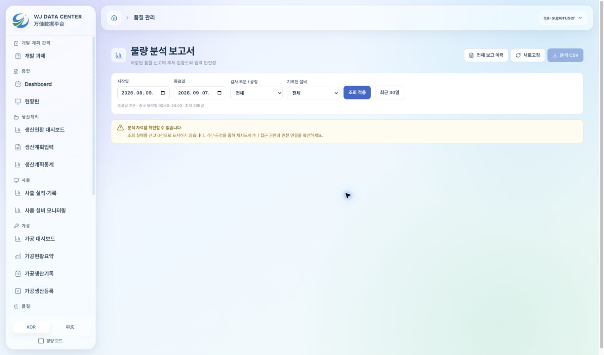

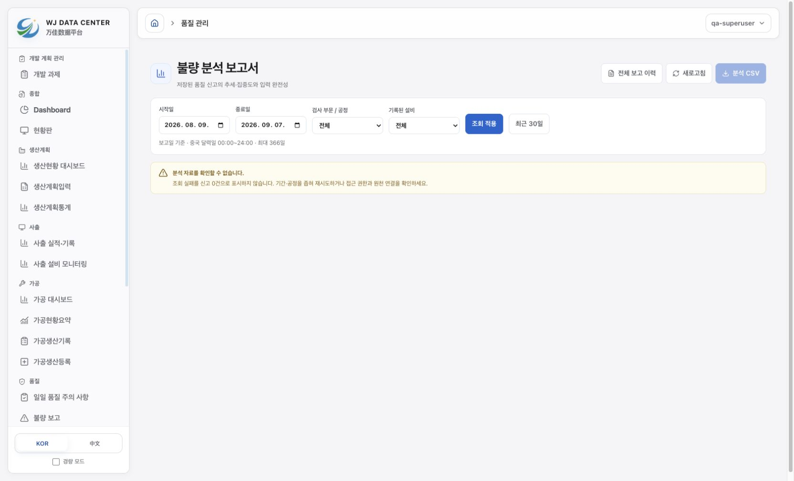

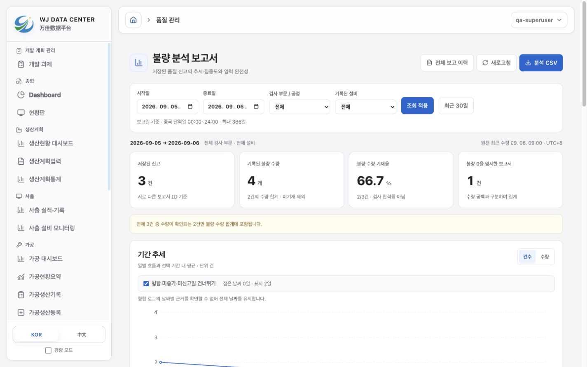

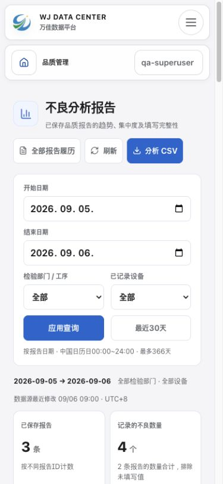

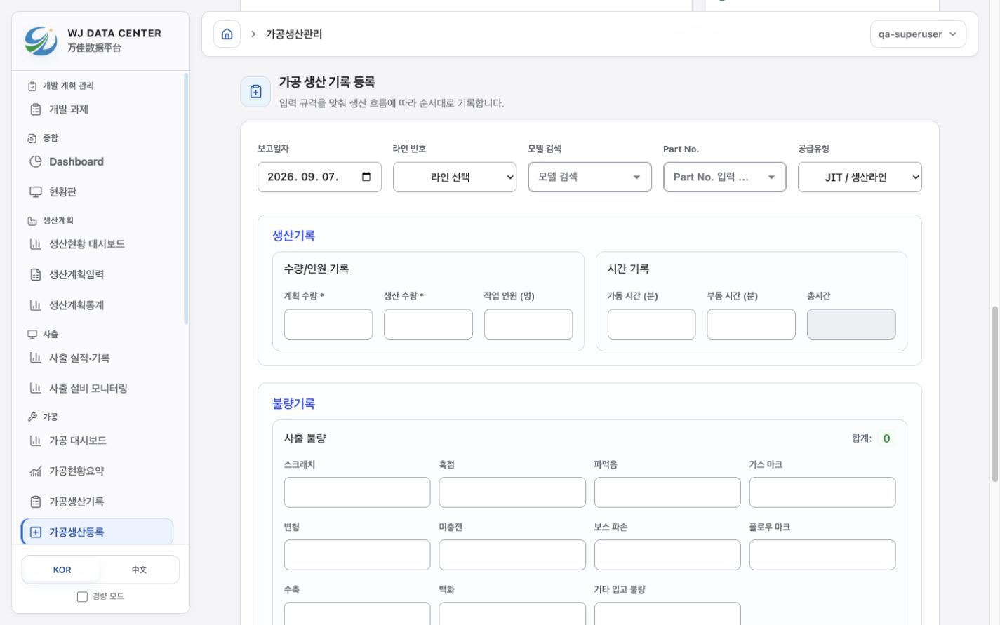

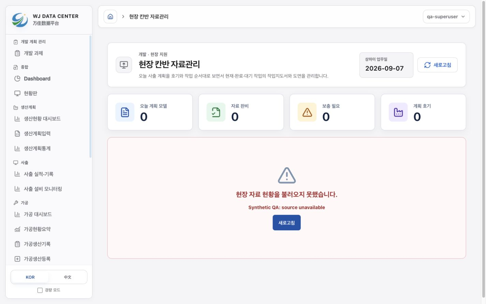

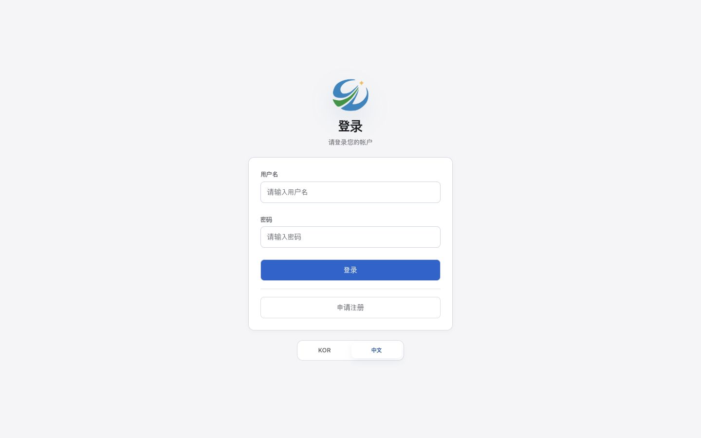

## 검사와 후속 확인

- 변경 CSS 4개를 PostCSS로 파싱: 성공.
- `./node_modules/.bin/eslint src/components/common/PageTransition.tsx`: 성공.
- 최종 `npm run build`: TypeScript·Vite·legacy CSS 모두 통과. 기존 큰 청크 경고는 남는다. 개발 과제 관련 프런트 테스트 12개·백엔드 18개도 통과했다.

실운영 자료를 사용한 200% 확대, 큰 데이터 표·그래프, 화면 읽기, 현장 단말과 낮은 성능 PC의 인수 확인은 후속 과제로 남긴다. `/assembly/dashboard`는 503 합성 환경에서 로딩 상태에 머물러 해당 대시보드의 데이터 화면은 검증하지 못했다. 가공 입력 페이지의 디자인 검증으로 대체한 범위를 위 표에 구분했다. 이 작업은 배포하지 않았다.

## 두 번째 제안 — 선택 표시·메뉴 계층은 유지, 청록 팔레트는 철회

사용자가 제공한 두 사이드바 캡처를 기준으로 선택 항목의 강한 파란 외곽선/왼쪽 선과 상위 분류보다 큰 하위 메뉴를 수정했다. 흰색·회색 중심이라는 피드백에 따라 공통 팔레트를 옅은 청록과 차분한 블루그린으로 변경했다.

- 사이드바 선택: 투명 테두리, 그림자/왼쪽 선 없음, `#d6e7e9` 배경과 `#195368` 글자. 마우스 hover는 더 연한 배경이다. 키보드 focus와 사용자 증가 대비 설정은 별도 표시를 유지한다.
- 계층: 상위 분류 16px/650, 하위 메뉴 14px/450(선택 550). 하위 들여쓰기와 그룹 간격도 구분했다. 모바일 메뉴는 44px 터치 높이를 유지한다.
- 팔레트: 배경 `#edf4f4`, 사이드바 `#e8f1f2`, 표면 `#fbfdfc`, 보조 표면 `#f2f8f7`, 본문 `#203b46`, 보조 글자 `#526d78`, 주요 동작 `#246e82`. 개발 과제·종합 분석·품질의 데이터 표면과 버튼도 공통 토큰에 연결했다.
- 개발 과제의 요약 및 목록 선택에서도 굵은 선을 제거했다. 완료·검증 대기·보류 등의 의미 색은 유지한다.

검증: 실제 로컬 화면에서 선택 테두리가 투명하고 `box-shadow: none`, 상위/하위 크기가 16px/14px임을 확인했다. 생산계획입력으로 실제 메뉴를 이동한 후에도 같은 상태를 확인했다. 390×844 모바일에서는 사이드바 범위가 x=8~382, 전체 가로 넘침 없음, 메뉴 높이 44px이었다. 선택 글자 대비 6.64:1, 사이드바 보조 글자 4.79:1, 주요 버튼의 흰 글자 5.79:1을 확인했다. 변경 CSS 4개 PostCSS 구문 검사와 전체 `npm run build`(TypeScript·Vite·legacy CSS) 및 `git diff --check` 통과. 이번에는 스타일 변경에 별도 동작 테스트를 추가하지 않았다. 운영 배포는 수행하지 않았다.

변경 파일: `main-theme.css`, `DevelopmentTasksPage.css`, `analysis.css`, `quality-analysis.css`, `AGENTS.md`의 디자인 지침과 이 문서.

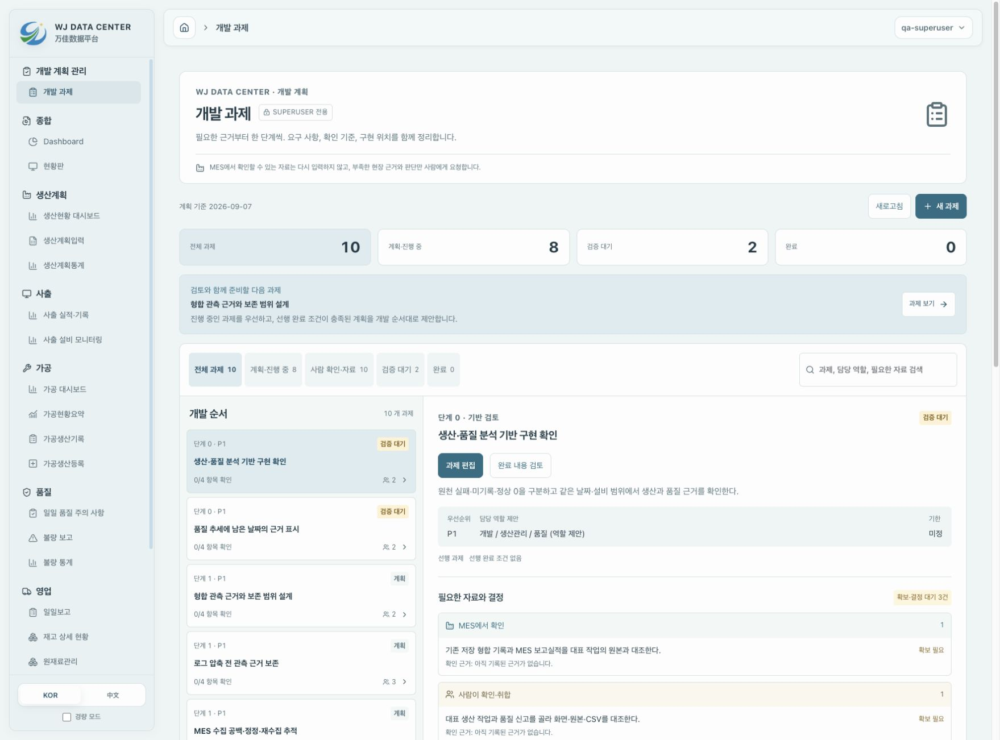

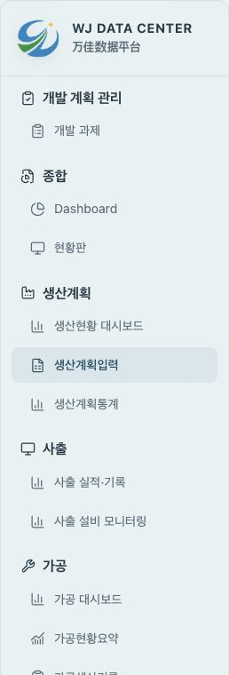

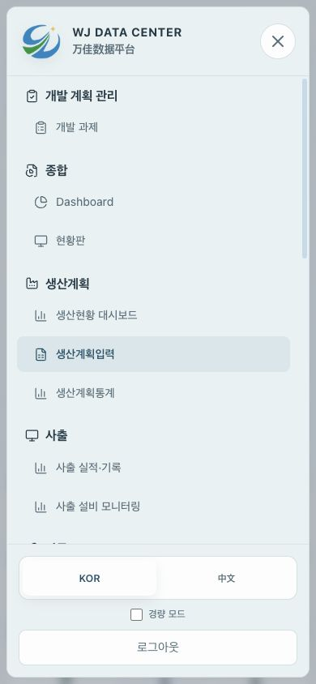

## 세 번째 제안 — 추가 다색 배색은 이후 피드백으로 철회

사용자는 원래의 알록달록한 화면보다 개편 후 디자인이 나빠졌다고 피드백했다. 최초 개편 전 `4e58aff`의 공통 스타일과 변경 전 화면을 대조하니, 보라·하늘·민트 배경을 단색으로 바꾸고 영역별 스타일 위에 공통 청록색을 강제한 것이 기존 인상을 크게 지웠다. 색상 단순화를 좋은 디자인으로 간주했던 판단을 철회했다.

- 배경: 원래의 라벤더·하늘·민트 방사형 그라데이션과 밝은 선형 그라데이션을 복원했다.
- 공통 영역: 원래 반투명 사이드바·상단 바·패널과 블루 계열 그림자를 되살렸다. 생산·가공 페이지의 고유 색을 덮던 토큰·아이콘·버튼 재정의는 제거했다. 공통 주요 버튼에는 흰 글자를 읽을 수 있는 짙은 블루–보라 그라데이션을 적용했다.
- 개발 과제: 요약 카드를 블루·라벤더·앰버·민트로 구분하고, 상단은 밝은 블루–라벤더, 다음 과제는 연한 보라색으로 표시한다. 요구사항은 MES 블루·사람 앰버·결정 보라색으로 구분한다. 페이지 바탕은 투명하여 원래 전체 배경이 이어진다.
- 사이드바: 강한 테두리와 왼쪽 선을 되살리지 않았다. 선택은 옅은 파란 배경과 짙은 글자이고, 상위 16px/650·하위 14px/450 계층을 유지했다.
- 개발 기준: `AGENTS.md`에 원래 다색 팔레트와 영역별 색을 보존하고, 흰색·회색 또는 단일 청록색으로 다시 단순화하지 않는다는 사용자 선호를 기록했다.

검증은 격리된 `5187` 로컬 프리뷰에서 수행했다. 개발 과제는 격리 SQLite의 10개 초기 과제, 품질은 원천 실패 상태를 사용했다. 데스크톱 1440×1000에서 상위/하위 메뉴의 실제 글자 크기는 16px/14px, 선택 테두리는 투명하고 그림자는 없었다. 390×844에서 메뉴 전환이 끝난 뒤 사이드바 범위는 x=8~382, 문서 너비는 390px, 메뉴 높이는 44px이었다. 화면 캡처를 원래 품질 화면과 비교하여 배경색과 반투명 표면이 돌아왔음을 확인했다.

검사: 변경 CSS 4개 PostCSS 파싱, `git diff --check`, `npm run build --prefix frontend`의 TypeScript·Vite·legacy CSS 빌드가 모두 통과했다. 기존 큰 JS 청크 경고는 남아 있다. 이번 수정은 스타일과 개발 지침·검토 기록이며 업무 API, 계산, 권한, 저장 동작은 변경하지 않았다. 운영 데이터에 연결하거나 배포하지 않았다.

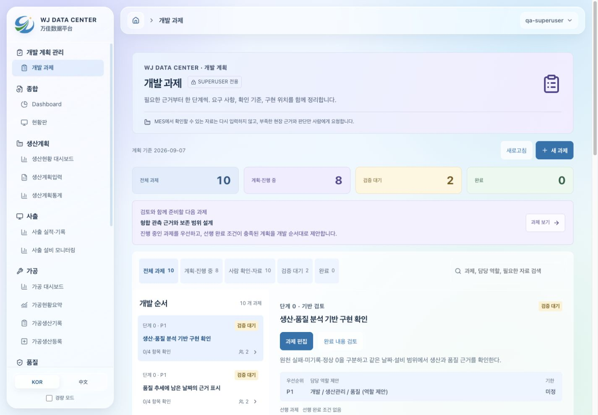

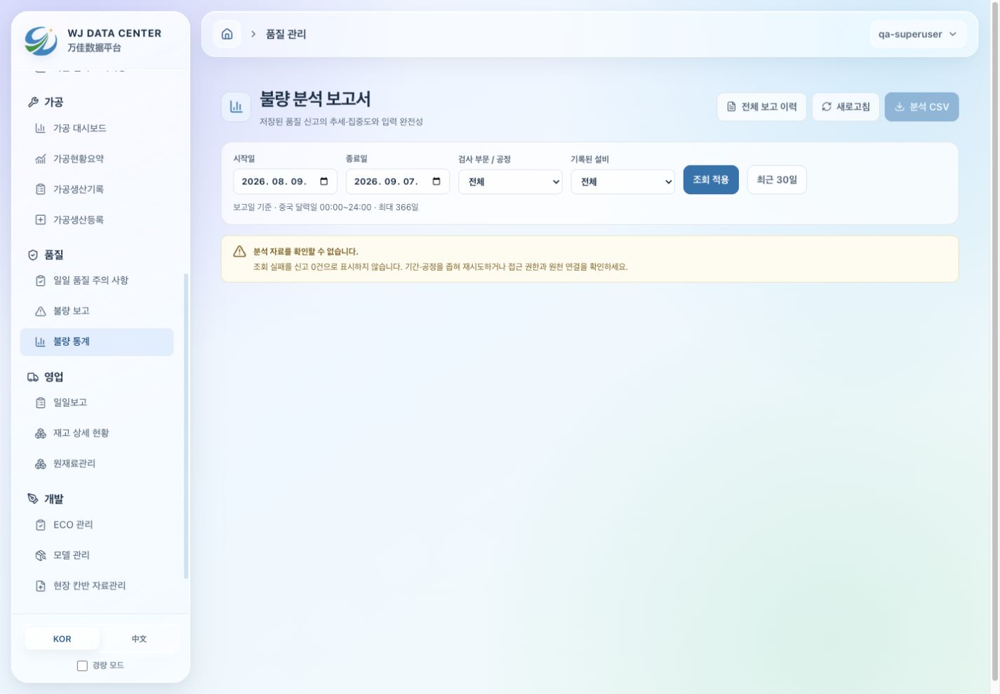

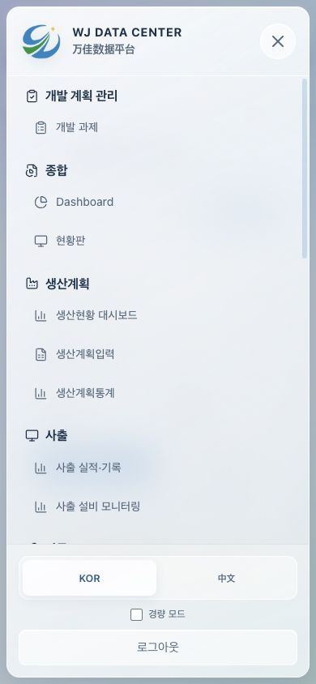

## 적용 전 색상 + 현재 폰트·구조 — 현재 최종 상태

사용자는 직전 제안도 너무 알록달록하다고 피드백했다. 새 팔레트를 만들지 않고, 애플 디자인 적용 전의 추적 코드 `4e58aff`와 기존 캡처를 색상 기준으로 삼았다. 공통 테마·종합 분석·품질·현장 자료 관리의 배경, 주요 글자와 동작 색을 원래 값으로 되돌렸다. 이미 개선한 보조 글자의 가독성과 키보드 포커스는 유지했다.

개발 과제 페이지의 최초 CSS 스냅샷은 없으므로 `before-tasks-desktop.png`에서 색을 확인했다. 캡처에서 측정한 네이비 `#1d3655`, 본문 `#f5f6fa`, 흰 카드, 보조 영역 `#eff4f8`·`#fafbfd`를 적용했다. 이 값들은 당시 CSS 원문 값이라는 주장이 아니라 캡처를 기준으로 맞춘 값이다. 직전 추가한 요약 카드 네 가지 배색, 요구사항 유형별 파스텔 바탕과 보라색 상단 그라데이션은 제거했다. 완료·검증 대기·보류 등의 상태색은 유지한다.

폰트·구조 보존 확인: 수정 전후 CSS 5개의 글꼴·크기·굵기·줄 간격·여백·레이아웃·폭/높이·모서리·전환 선언을 PostCSS로 비교하여 모두 동일함을 확인했다. 사이드바 상위 16px·하위 14px과 은은한 선택 배경도 유지한다. `AGENTS.md`에는 **기존 색상 / 현재 폰트와 구조**를 기준으로 기록했다.

검증: 격리된 5187 로컬 프리뷰에서 개발 과제 1440×1000 및 390×844, 현장 자료 관리의 빈 상태를 확인했다. 개발 과제의 데스크톱 문서 폭은 1425px, 모바일은 375px(스크롤바 제외)로 가로 넘침이 없었다. CSS 5개 구문 파싱, 구조·폰트 선언 비교, `git diff --check`, 전체 `npm run build --prefix frontend`(TypeScript·Vite·legacy CSS)가 통과했다. 기존 큰 청크 경고는 남아 있다. 실제 MES 데이터 검증이나 운영 배포는 수행하지 않았다.

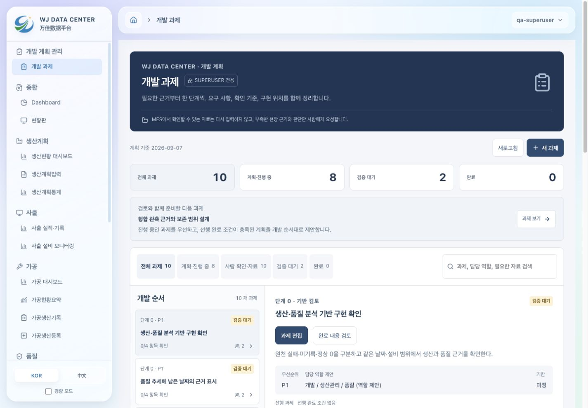

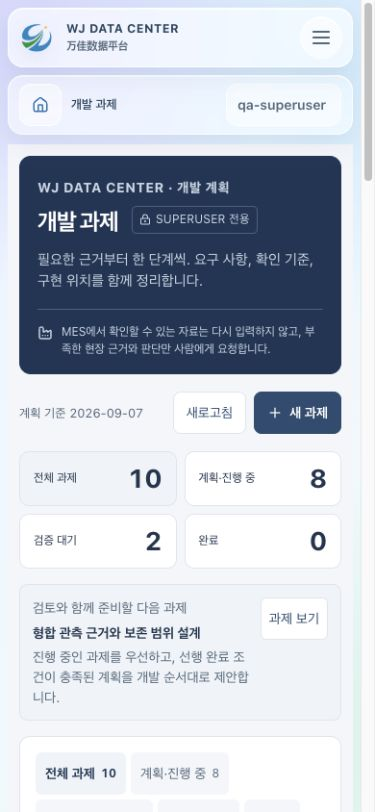
