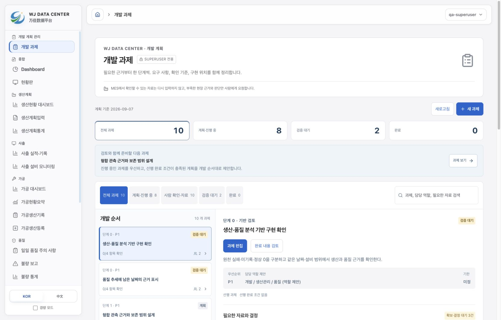
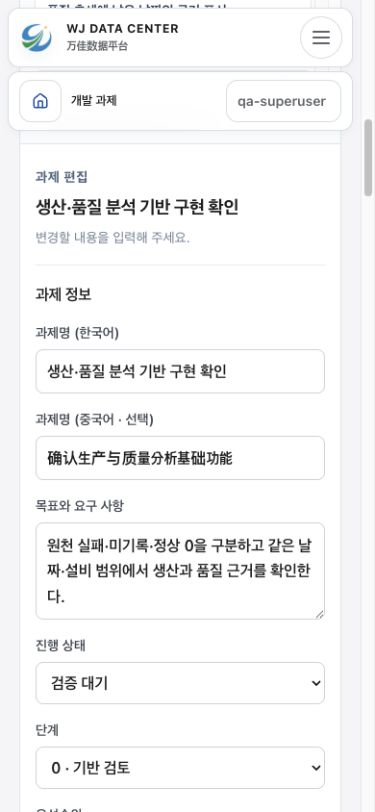

# 개발 과제 관리 페이지

2026-09-07. 기준 코드 `4e58afff`, 작업 브랜치 `codex/development-tasks-20260907`.

개발 순서, MES 자료, 사람이 확인할 사실, 의사결정, 완료 조건과 구현 위치를 한곳에서 관리하는 페이지다. 과제·체크 상태·자료 근거·변경 이력을 전용 백엔드 모델에 저장하도록 구현했다. 모델과 마이그레이션은 로컬에서 검증했으며 운영 DB에는 적용하지 않았다. 이 문서가 기록하는 작업은 아직 커밋·배포되지 않았다.

## 접근과 화면 사용법

활성 superuser가 로그인하면 사이드바 최상단 **개발 계획 관리 → 개발 과제**에서 `/admin/development-tasks`로 이동한다. 일반 staff나 `permissions.is_admin`만으로는 접근할 수 없다. 프런트엔드는 서버가 반환한 읽기 전용 `is_superuser`로 메뉴와 직접 URL을 제한하고, 일반 관리자 우회보다 먼저 과제 경로를 검사한다. 백엔드는 모든 조회·초기화·생성·수정 요청에서 인증 여부, `is_active`, `is_superuser`를 다시 검사한다. 응답에는 `Cache-Control: private, no-store`를 적용한다.

1. 처음에는 **기본 개발 계획 등록**으로 미등록 과제를 추가한다. 조회만으로 초기 목록을 만들지 않으며, 다시 등록해도 기존 과제와 사용자가 수정한 내용을 덮어쓰지 않는다.
2. 목록에서 진행 상태·사람 확인 필요 여부로 범위를 좁히거나 제목·목표·담당·요구 자료·확인 근거를 검색한다. 다음 개발 제안은 진행 중 과제를 우선하고, 없으면 선행 과제가 완료된 계획 과제 중 정렬 순서로 선택한다.
3. **새 과제** 또는 **과제 편집**에서 목표, 단계, 우선순위, 담당 역할/담당자, 기한, 선행 과제와 자료 요청을 작성한다. 과제 주소 ID는 등록 후 변경할 수 없다.
4. 체크리스트를 누르면 편집 상태에서 확인값을 바꾼다. 자료 상태와 근거, 변경 사유를 검토하고 **변경 저장**해야 서버에 반영된다. 초안이나 확인값 변경만으로 저장 완료를 표시하지 않는다.
5. **완료 내용 검토**에서 해결 내용·검증·구현 위치를 채우고 완료한다. 다시 작업이 필요하면 **진행 재개**와 사유를 기록한다. 완료된 후속 과제가 있으면 후속 과제부터 재개해야 한다.

저장 실패와 버전 충돌 시 작성 내용은 편집 화면에 남는다. **최신 내용 불러오기**는 작성분을 버리기 전에 확인한다. 같은 계정·같은 탭의 `sessionStorage`에는 미저장 초안 복구본을 둘 수 있지만 이는 서버 저장이나 다른 기기 공유가 아니다. 복구해도 작성 당시 version을 유지하므로 다른 창의 변경을 무시하고 덮어쓰지 않는다. 프런트엔드의 최종 동작·좁은 화면 검증 결과는 아래 검증 절에 별도로 기록한다.

## 초기 계획 10개와 자료 수집 원칙

초기 목록의 원천은 [development_task_catalog.py](../../backend/analytics/development_task_catalog.py), 버전은 `2026-09-07`이다. 담당은 역할 제안이며 특정 직원이 배정됐다는 의미가 아니다. 모든 초기 체크리스트는 미확인 상태로 시작한다. 코드 존재나 합성 테스트만으로 업무 인수를 완료 처리하지 않는다.

| 순서 | 과제 | 우선 확인할 자료·업무 | 초기 상태 |
| --- | --- | --- | --- |
| 1 | 생산·품질 분석 기반 구현 확인 | 기존 MES·형합·품질 원본과 화면·CSV의 실제 업무 대조 | 검증 대기 / 코드 있음 |
| 2 | 품질 추세에 남은 날짜의 근거 표시 | 날짜별 판정 사유, 관측 설비 수, 실제 API 판정 | 검증 대기 / 서비스 미반영 |
| 3 | 형합 관측 근거와 보존 범위 설계 | 장치·관측시각·형합수, 기대 설비 이력, 보존 기간·용량 | 계획 |
| 4 | 로그 압축 전 관측 근거 보존 | 원시 관측과 압축 전후 판정 비교, 저장 실패 시 원시 근거 보존 | 계획 |
| 5 | MES 수집 공백·정정·재수집 추적 | 수집 성공 범위, 보고 ID, 지연 보고·정정·취소 사례 | 계획 |
| 6 | 사출 한 작업의 MES·현장 기록 연결 | 작업·설비·품번·단위, 실제 교체와 유효 Cavity, 마감 기준 | 계획 |
| 7 | 대표 예외 한 종류의 확인·조치·완료 | 원본 연결, 담당·기한·완료 근거, 재개·재발 기준 | 계획 |
| 8 | 검사 이벤트와 실제 발생 근거 정리 | 정상/재검사 모집단, 실제 발생시각, 검사·불량 개체 수와 처분 | 계획 |
| 9 | 한 출고 품목의 재고·생산·납기 연결 | 가용·보류·예약·수요·입고·출고 이력, 단위와 고객 약속 기준 | 계획 |
| 10 | 유효기간이 있는 생산 효율·비용 근거 | 동시 전력·형합, C/T·Cavity 변경 시점, 단가·요율·공수 | 계획 |

자료 요청은 다음 세 종류로 나눈다.

- **MES:** 기존 승인된 조회 경로에서 재사용할 데이터와 제공 범위를 확인한다. MES 필드가 아직 확인되지 않았다면 확보 상태로 표시하지 않는다. 이 페이지가 MES 수집을 실행하거나 원천 데이터를 변경하지는 않는다.
- **사람 확인:** 실제 교체 시각, 시험/양산 구분, 정지 사유, 검사 결과, 처분, 원인·조치 등 사람이 확인해야 하는 사실을 요청한다. 자동으로 알 수 있는 설비·작업·계수는 재입력하지 않는 방향이다.
- **결정:** 공식 마감 책임자, 생산 구간 단위, 검사 모집단, 보존 기간, 고객 약속 평가와 같은 업무 기준을 정한다.

자료 상태는 `needed`(필요), `requested`(요청 중), `ready`(확보)다. 확보 상태로 저장하려면 확인 근거가 필요하다. 운영 데이터나 계정 정보 자체를 이 과제 문서에 복제하기보다 승인된 원본·작업 식별자·검토 기록을 근거로 남긴다.

단계가 높다는 이유만으로 앞 단계의 모든 기능을 기다리지는 않는다. 대표 작업·예외의 업무 설계는 관측 보존과 병행할 수 있다. 자동 귀속·자동 마감·검사 불량률은 각각 필요한 근거가 확보된 뒤 도입한다. 계산형 RAG의 수치는 기존 결정적 계산과 API에서 가져오며, 문서 RAG·벡터 DB는 P1 안정성과 별도 업무 필요를 확인한 뒤 검토한다.

## 완료와 서비스 반영을 구분하는 계약

과제 상태는 `planned` / `in_progress` / `blocked` / `review` / `done`이다. `done` 저장 시 서버가 다음 조건을 검증한다.

- 체크리스트가 하나 이상이며 모든 항목이 확인되어 있다.
- 등록된 자료·확인·결정 요청이 모두 확보 상태이고 근거가 있다.
- 담당, 해결 내용(`completion_note`), 검증 내용(`verification_note`)이 비어 있지 않다.
- 구현 화면·코드 또는 확정 문서 위치가 하나 이상 있다.
- 선행 과제가 실제로 존재하고 모두 완료되어 있다. 자기 참조·중복·순환 의존성을 허용하지 않는다.

서비스 반영 상태는 `unreleased` / `code_available` / `deployed`로 따로 저장한다. 검증 완료와 배포는 같은 의미가 아니며, 이 페이지에서 상태를 바꿔도 코드 병합·배포가 실행되지 않는다. `deployed` 표시는 실제 서비스 확인 근거와 함께 관리해야 한다. 기존 화면·코드 링크는 **기존 참고**로 명시해 계획 목표가 이미 구현됐다고 오해하지 않게 한다.

완료 시 서버가 `completed_at`을 기록한다. 완료 상태를 유지하는 편집에서는 최초 완료 시각을 보존하고, 재개하면 현재 완료 시각을 비운다. 이전 완료 시각·근거는 이력 스냅샷에 남는다. 과제 전체 삭제와 이력 수정 API는 제공하지 않는다.

## API와 영속 저장

모든 경로의 접두어는 `/api/analytics/development-tasks/`다. 이번 구현의 목록 응답은 `read_only: false`이며 저장 기능을 제공한다.

| 메서드·경로 | 동작 |
| --- | --- |
| `GET /` | 저장된 목록·카탈로그 버전·`needs_initialization` 반환. DB를 변경하지 않음 |
| `POST /initialize/` | 빈 요청으로 미등록 기본 과제만 추가. 같은 요청 반복 시 기존 과제·이력 유지 |
| `POST /` | 새 과제 생성. 고유 slug 필요, 새 과제에 version 지정 불가 |
| `GET /<slug>/` | 현재 과제와 최근 이력 조회 |
| `GET /<slug>/?history_before=<id>` | 해당 과제의 더 오래된 이력 조회 |
| `PATCH /<slug>/` | 편집 가능한 전체 필드와 현재 version·변경 사유를 보내 수정 |

입력은 JSON이며 지원하지 않는 필드·중복 항목 ID·잘못된 상태·링크를 거절한다. 화면 위치는 `/`로 시작하는 내부 경로, 코드·문서는 내부 경로 또는 HTTPS 링크를 사용한다. `initialize`는 라우트와 충돌하지 않도록 새 과제 ID로 사용할 수 없다. 목록은 최대 500개, 과제 입력은 직렬화 기준 512,000바이트로 제한한다.

[models.py](../../backend/analytics/models.py)에 두 모델을 추가했다.

- `DevelopmentTask`: 목표·자료 요청·체크리스트·의존성·담당/기한·구현 위치·완료 기록·서비스 반영 상태와 version을 저장한다.
- `DevelopmentTaskHistory`: 서버가 기록한 변경자, 작업 종류, 변경 사유, 변경 필드, 이전/이후 스냅샷과 시각을 저장한다. API를 통해 추가만 하며 과제의 이력 연결은 보호한다.

해당 변경은 [0002_development_tasks.py](../../backend/analytics/migrations/0002_development_tasks.py)에 분리했다. 다른 생산·품질 업무 테이블에 과제 상태를 저장하지 않는다. 모델·마이그레이션 작성과 로컬 검증을 완료했지만 운영 DB 마이그레이션 적용은 수행하지 않았다.

과제 생성·수정·초기화와 이력 작성은 같은 트랜잭션에 포함한다. 기존 과제 수정에는 `version`과 비어 있지 않은 `change_note`가 필요하다. 저장된 version과 다르면 **409 Conflict**로 거절하며 기존 데이터와 이력을 바꾸지 않는다. 실제 내용 변경이 없는 요청은 version을 올리거나 새 이력을 만들지 않는다.

이력은 최신 ID부터 한 번에 최대 50개를 반환한다. 더 있으면 `next_history_before`를 제공하며, 다음 조회는 그 ID보다 작은 해당 과제의 이력만 읽는다. 화면/API의 이력은 변경자·작업·사유·변경 항목·시각을 제공한다. 이전/이후 전체 스냅샷은 DB에 보존하며 현재 이력 API에는 포함하지 않는다.

## 의존성 변경과 동시 저장

[development_task_service.py](../../backend/analytics/development_task_service.py)의 `locked_tasks()`를 모든 쓰기 경로가 트랜잭션 안에서 호출한다. PostgreSQL에서는 공통 트랜잭션 advisory lock `pg_advisory_xact_lock(1464484932, 1)`을 먼저 취득한 다음 전체 과제 행을 ID 순서로 잠그고 의존성 그래프를 읽는다. 최초 빈 목록도 같은 잠금 범위에 포함한다.

이 순서는 전체 행 잠금 조회가 기다리는 사이 생성된 과제를 놓치는 문제를 막기 위해 적용했다. 예를 들어 새 완료 과제가 기존 완료 과제를 선행으로 연결하는 동시에 다른 창에서 그 선행 과제를 재개하려 하면, 뒤 요청은 먼저 저장된 새 관계까지 읽고 완료된 후속 과제의 재개 여부를 검사한다. 같은 과제에 대한 version 조건부 갱신도 별도로 유지한다.

SQLite에서는 `SELECT FOR UPDATE`가 실질 행 잠금을 제공하지 않으므로 version 조건부 갱신으로 오래된 같은 과제의 덮어쓰기를 막는다. 아래 SQLite 회귀 통과는 PostgreSQL의 실제 동시 요청·잠금 동작을 부하 환경에서 검증했다는 뜻은 아니다.

## 기존 별도 작업과 통합 상태

- `analysis-baseline`은 기준 main `4e58afff`에 있는 분석 기반 기능을 가리킨다. 코드 구현은 확인했지만 현장 인수를 자동 완료하지 않아 검증 대기로 등록한다.
- 품질 추세 날짜 사유 UI는 `wj_reporting-quality-trend-display` 작업 트리의 별도 로컬 변경이다. 이번 과제 관리 작업 트리에 통합하거나 서버에 배포하지 않았다. 카탈로그의 해당 과제에는 서버 구현 위치 링크를 두지 않았다.
- 개발 방향 재검토 문서는 `wj_reporting-roadmap-review` 작업 트리의 별도 미커밋 변경이다. 그 검토 방향을 초기 계획에 반영했지만 해당 문서 변경 자체를 이번 작업 트리에 통합하거나 배포하지 않았다. 기존 사이트 보고서가 갱신됐다고 표시하지 않는다.
- 일요일·공휴일·신고 0건으로 무생산을 추정하지 않는다. 2026-08-16·08-23도 형합 근거가 부족하면 유지한다. 두 날짜의 운영 API 판정이 확인됐다고 주장하지 않는다.

## 검증 결과

운영 설정·DB·MES API를 사용하지 않는 격리된 로컬 Django/SQLite 환경에서 검증했다.

- `analytics.test_development_task_contract`와 `analytics.test_development_task_persistence`: **18개 통과**. 활성 superuser 전용 조회/쓰기, GET 무변경, 초기화 반복과 기존 편집 보존, 새 요청의 저장 재조회, 서버 변경자와 스냅샷, 오래된 version 거절, 완료·재개, 의존성 오류, 예약 ID, 무변경 수정, 삭제 거절, 과제별 50개 이력 페이지를 확인했다.
- `makemigrations --check`: 모델과 마이그레이션의 정합성 검사 통과. 운영 DB에 마이그레이션을 적용한 결과가 아니다.
- 독립 코드 리뷰에서 발견한 `initialize` ID 충돌과 PostgreSQL 신규 행 누락 가능성을 수정했다. PostgreSQL 동시 요청 재현은 별도로 남아 있다.

통합 검증 결과:

- `backend/.venv/bin/python scripts/check-development-tasks.py`에 해당하는 기존 Python 환경에서 18개 테스트와 마이그레이션 정합성 검사를 재현했다. 스크립트는 프로젝트 설정·`.env`를 불러오지 않는다.
- `node --experimental-strip-types --test frontend/tests/development-task-access.test.ts frontend/tests/development-tasks.test.ts`: **12개 통과**. 권한·payload·완료 조건·검색·의존성·링크·24시간 초안 복구 계약을 검증했다.
- 변경 TSX/TS와 관련 테스트의 focused ESLint: 오류 0. 기존 `AuthContext.tsx`의 Fast Refresh export 경고 1개가 남는다.
- 최종 `npm run build`: TypeScript, Vite 및 legacy CSS 빌드 통과. 기존 500kB 초과 청크 경고는 남는다.
- 실제 Django 뷰와 JWT 인증에 연결한 격리 SQLite/로컬 Vite(5187)에서 기본 10개 등록, 새 QA 과제 생성, 완료 근거 저장, 재개, 새 요청 재조회와 이력을 확인했다. DB의 QA 이력은 `create → complete → reopen → update`, version은 4였다.
- 별도 로컬 API 요청으로 먼저 변경한 뒤 브라우저의 기존 초안을 저장하면 409가 표시되고 입력값이 보존되는 것을 확인했다. 최신 서버 값이 덮어써지지 않았다.
- Chrome에서 페이지 이동 이력을 만든 뒤 미저장 편집 → 브라우저 뒤로 → 앞으로 → 초안 복구를 실행했다. 복구 버튼과 작성한 담당자 값을 확인했다. 복구 후 편집 취소 확인창 처리에서 브라우저 자동화가 멈춰 해당 추가 확인은 완료로 주장하지 않는다. 검증 탭은 닫았다.
- staff이면서 관리자 권한이 있는 QA 사용자로 직접 과제 URL을 열면 `/analysis`로 이동하고 과제 메뉴가 없음을 확인했다. 서버 읽기/쓰기 차단은 별도 백엔드 테스트로 확인했다.
- 데스크톱 1679×1075에서 과제 제목과 목록을 캡처했고, 모바일 390×844에서 편집 입력·44px 조작·가로 넘침 없음을 확인했다. 흰색 제목의 오래된 덮어쓰기 규칙과 편집 제목이 고정 헤더 뒤에 숨는 스크롤 위치를 수정했다.
- QA 과제와 그 이력만 임시 DB에서 정리해 미리보기에는 초기 계획 10개가 남는다. 운영 데이터는 사용하지 않았다.

디자인의 데스크톱·모바일·중문 화면 증거와 확인 범위는 [디자인 검토 기록](2026-09-07-apple-design-review.md)에 있다.

## 변경 범위와 다음 인수

백엔드는 `analytics`의 카탈로그·권한·serializer·service·views, URL, 모델 2개와 마이그레이션 0002, 계약·영속성 테스트를 포함한다. 사용자 응답에는 읽기 전용 `is_superuser`를 추가했다. 프런트엔드는 메뉴/경로 접근 제어, 개발 과제 목록·편집·자료/체크·완료·이력 화면과 관련 테스트를 포함한다.

다음 인수는 PostgreSQL의 동시 생성·수정 확인, 실제 적용 대상에서의 마이그레이션·서비스 반영 및 활성 superuser 업무 확인이다. 구현과 테스트 결과를 검토한 뒤 각 적용 상태를 별도로 기록한다. 이번 작업으로 MES 수집·운영 계측 보존 정책·생산 데이터·인증 정보·배포 설정을 변경하지 않았다.

## 최종 화면

