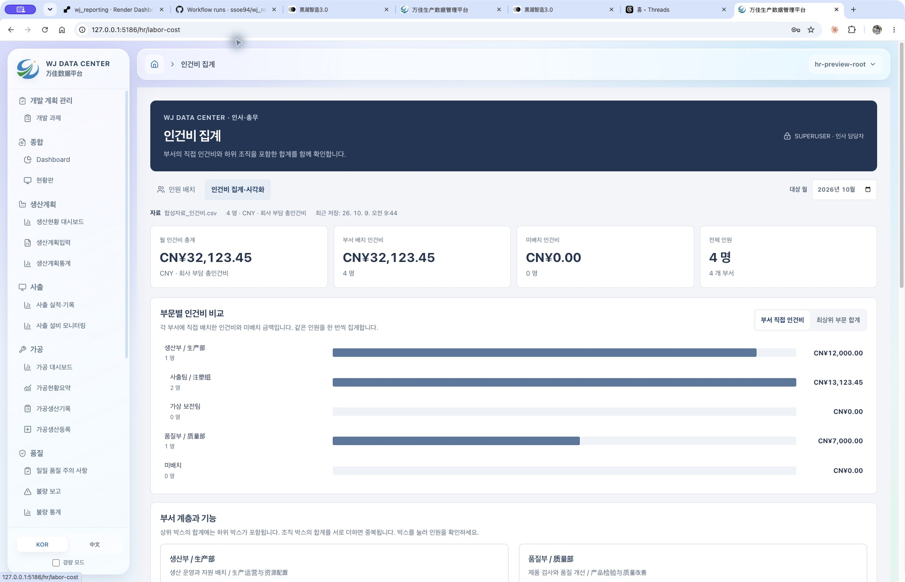
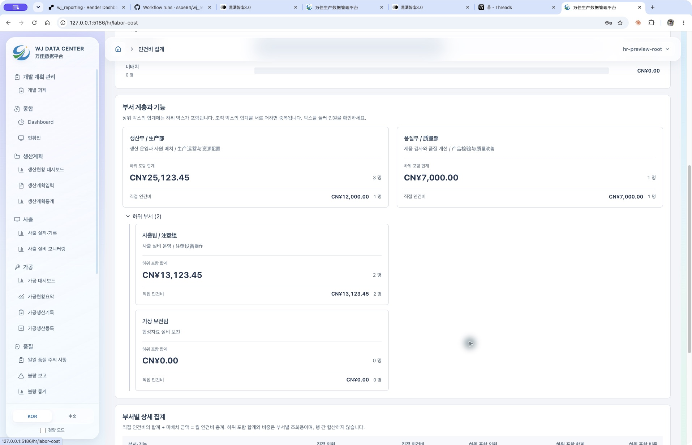
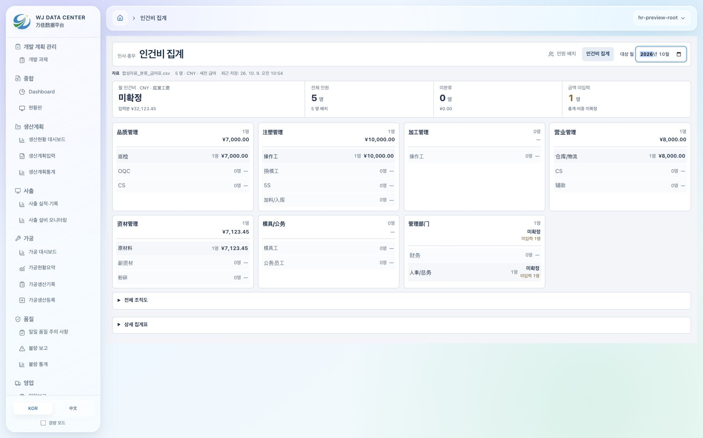
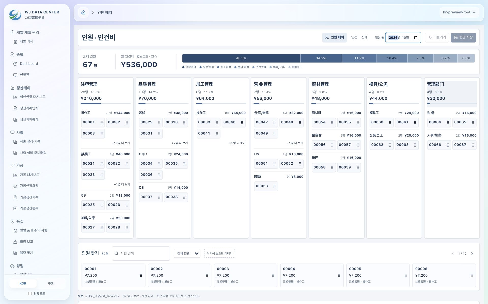
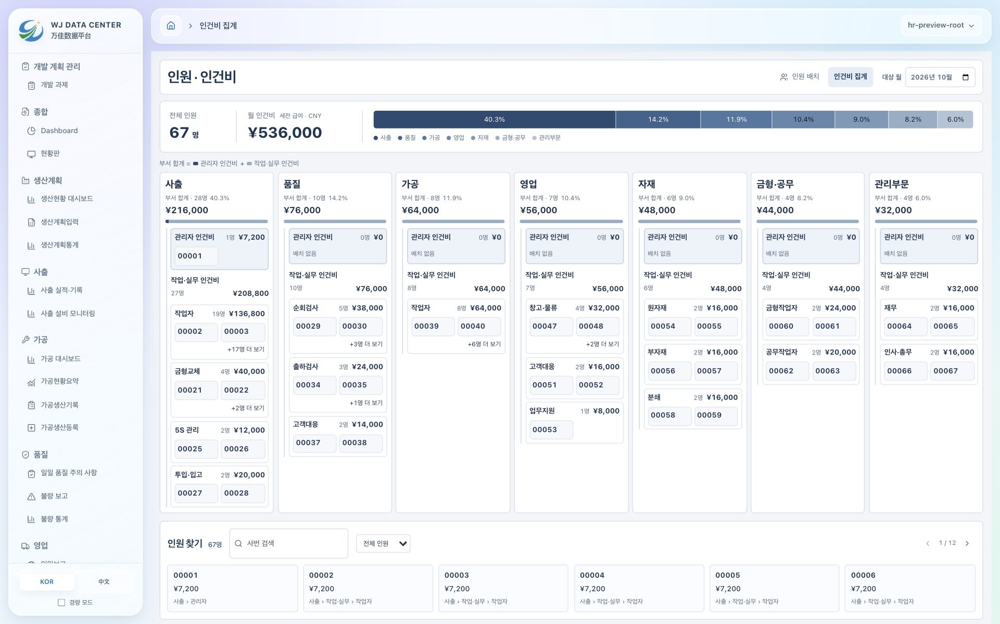
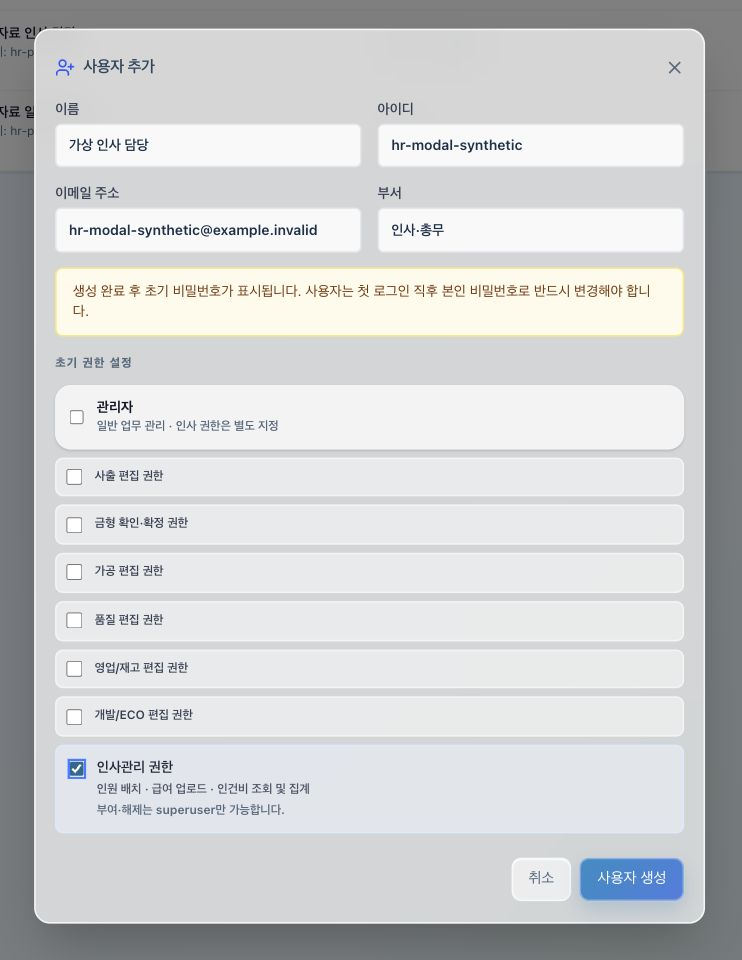

# 인사·총무: 월별 인원 배치와 인건비 집계

2026-10-09 로컬 구현. 브랜치 `codex/hr-labor-cost-20261009`. 운영 배포, 운영 DB 마이그레이션, 실제 급여 파일 대사는 수행하지 않았다.

## 화면과 업무 기준

사이드바 `개발` 다음에 `인사·총무` 그룹을 추가한다.

- `/hr/personnel`: 월별 파일 업로드, 시트·제목 행·열 연결, 서버 검증 미리보기, 부서 계층·기능 편집, 인원 배치 및 저장.
- `/hr/labor-cost`: 전체/배치/미배치 비용, 직접 비용 또는 최상위 부문 합계 비교, 조직 박스, 부서별 표, 인원 상세.

입력은 XLSX 또는 UTF-8 CSV다. 직원별 한 행에 사번, 이름, 선택 직책, 월 인건비 한 값을 사용한다. 사번 앞자리 0은 파일에 저장된 서식을 보존한다. 이름만으로 사람을 합치지 않는다. 시트, 제목 행, 금액 열, 대상 월, 통화 및 집계 기준을 사용자가 선택한다. 원본 파일·주민번호·계좌번호 등 미선택 열은 서버에 전송하거나 보관하지 않는다.

기본 기준은 회사 부담 총인건비다. 세전 급여 또는 직접 정의한 기준도 선택할 수 있다. 파일의 여러 수당·보험 열을 자동으로 합산하지 않는다. 선택한 금액 열이 원하는 비용 범위를 포함하는지 실제 파일 인수가 필요하다. 지원 통화는 CNY/KRW/USD이며 환산하거나 섞어 합산하지 않는다.

한 사람은 해당 월에 한 부서에 100% 배치하거나 미배치 상태로 둔다. 겸직 비율 배분과 일할 계산은 이번 범위에 포함하지 않는다. 상위 부서에는 하위 인원의 비용·인원이 포함되므로 상·하위 박스 합계를 다시 더하지 않는다. 직접 비용 합계 + 미배치 비용 = 월 총계다. 서버는 Decimal, 화면의 임시 배치 미리보기는 정수 센트로 계산한다.

배치와 인건비는 월별 스냅샷이다. 이번 달 이동으로 다른 달이 바뀌지 않는다. 자료 재업로드는 선택 월의 직원 목록과 비용을 교체하며 동일 사번의 배치를 유지한다. 빠진 사번은 그 월의 현재 명단에서 제외되지만 이전 저장 이력은 보존한다. 동일 정규화 내용의 재업로드는 버전을 증가시키지 않는다.

부서는 최대 200개/8단계, 직원은 최대 5,000명, 파일은 10MB, 서버 JSON은 6MB다. 직원당 금액은 0 이상 999,999,999.99 이하, 소수점 두 자리 이내다. 음수, 중복 사번, 빈 필수값, 오류 셀 및 숫자 결과가 저장되지 않은 수식은 거부한다. 앱이 수식을 재계산하지 않는다.

## 접근 권한과 저장

활성 superuser 또는 `HrAccessGrant.enabled`가 참인 활성 사용자만 모든 HR API를 사용할 수 있다. 일반 staff, `is_admin`, 부서명, 그룹명으로 권한을 추론하지 않는다. superuser만 담당자를 지정/해제할 수 있다. 사용자 응답의 `can_access_hr`와 `is_superuser`는 읽기 전용이다. 직원 명단과 로그인 계정은 별도다.

API 응답에는 `private, no-store`를 적용한다. 급여는 React 메모리에만 두며 localStorage/sessionStorage/query cache에 저장하지 않는다. HR API 오류 응답을 공통 콘솔 로그에서 제외한다. 권한 해제 후 다음 요청부터 서버가 거부한다.

변경은 현재 version을 요구한다. PostgreSQL에서는 월별 트랜잭션 advisory lock을 행 조회 전에 취득하며, 갱신은 version 조건을 포함한 compare-and-swap으로 수행한다. 존재하지 않는 월의 동시 생성도 고유 제약과 충돌 응답으로 처리한다. 저장과 이력은 같은 트랜잭션이다. 오래된 version에는 409를 반환하며 화면 초안을 자동으로 덮어쓰지 않는다. 저장 이력의 작성자·시각은 서버가 기록한다.

추가 마이그레이션 `analytics/0003_hr_monthly_workspaces.py`는 새 테이블 4개만 만든다. 기존 테이블·데이터를 변경하거나 기존 마이그레이션을 수정하지 않는다. 로컬 SQLite 검사와 실제 PostgreSQL 운영 적용은 별도 단계다.

## 구현 위치와 검증

- 서버: `backend/analytics/hr_*.py`, `models.py`, `migrations/0003_hr_monthly_workspaces.py`; 사용자 표시 `backend/injection/serializers.py`.
- 화면: `frontend/src/pages/hr/`, `frontend/src/domains/hr/`; 메뉴/경로 접근 `App.tsx`, `AuthContext.tsx`, `domains/auth/hr-access.ts`.
- 독립 서버 검사: `backend/.venv/bin/python scripts/check-hr.py`. 운영 설정 및 `.env`를 읽지 않고 임시 SQLite에서 마이그레이션·권한·집계·재업로드·409·이력 롤백을 검사한다.
- 프런트 검사: `node --experimental-strip-types --test tests/hr-access.test.ts tests/hr-import.test.ts tests/hr-layout.test.ts` (`frontend/`에서 실행).
- 배포물 빌드: `npm run build` (`frontend/`에서 실행), legacy 빌드 포함.

독립 HR 서버 검사 23개, 기존 개발 과제 회귀 검사 18개, HR 프런트 검사 17개와 기존 경로 권한 검사 2개가 통과했다. 전체 TypeScript/Vite/legacy 빌드도 통과했다. 기존 큰 번들 경고와 Fast Refresh 보조 함수 export 경고가 남으며 ESLint 오류는 없다.

합성 자료로 다음 화면 동작을 확인했다.

- XLSX 업로드 → 빈 시트 안내 → 자료 시트 열 연결 → 서버 미리보기(4명/32,123.45 CNY) → 업로드 확정.
- 부서 및 하위 부서 추가/기능 편집/저장. 버튼으로 인원 이동/미배치 복귀 후 저장, 집계 화면에서 배치/미배치 금액 확인.
- 직접 비용 비교, 최상위 부문 합계, 상·하위 조직 박스, 부서 인원 상세 및 하위 인원 포함 선택.
- 언어 변경 시 미저장 배치 유지. 동시 서버 저장 후 409와 초안 유지/저장 차단 표시.
- 모바일 CSS 뷰포트 390×843에서 페이지 가로 넘침 없음. 상세 표는 자체 스크롤. Chrome 데스크톱에서 조직 박스 및 버튼 이동 확인.

실제 드래그 시작과 Escape 취소는 Chrome에서 관찰했다. 자동 조작에서 최종 놓기 완료는 확인하지 못했으므로 실제 포인터로 명단→부서, 부서→부서, 부서→미배치 이동 인수가 남는다. 409 후 최신 자료를 다시 불러오는 확인창도 자동 조작 도구가 차단된 상태여서 수동 확인이 필요하다. 실제 장치 터치 인수, 실제 급여 파일 대사, PostgreSQL 동시 트랜잭션 및 운영 배포 검증은 수행하지 않았다.

아래 화면은 실제 회사 인원·급여가 아닌 합성 자료다.

다음 인수는 실제 회사 파일의 월·통화·금액 열 범위와 전체 합계를 확인하고, 인사 담당자 계정의 지정 대상을 확정하는 것이다. 운영 반영 요청이 있으면 PostgreSQL 마이그레이션 검토·CI·배포·권한별 실제 화면을 별도로 확인한다.

## 회사 표 형식과 콤팩트 화면 반영

사용자가 추가 제공한 분류 그림은 회사 기능 기준으로 사용한다. 고정된 큰 도식을 그대로 재현한 중간 화면은 사용자에게 거절됐으며 최종 기본 화면은 요약 한 줄과 7개 부문 카드로 바꿨다. 인원 상세, 전체 조직도, 집계표, 분류 편집, 계정 권한은 필요할 때 펼친다. 새 카드 구성은 `CompanyClassificationChart.tsx`, 전체 조직도는 `CompanyOrganizationChart.tsx`에 있다.

입력 기준은 사용자 확정대로 `应发工资`와 추가할 **시각화 부문·시각화 기능** 두 열이다. 중국어 권장 열 이름은 `可视化部门`, `可视化职能`이며 한국어 이름도 인식한다. `部门`은 원본 부서로 따로 보관하고 새 분류를 추론하지 않는다. 예: `品质管理 / CS`와 `营业管理 / CS`, `注塑管理 / 操作工`와 `加工管理 / 操作工`는 서로 다른 ID다. 회사 고정 기능의 상위 부문 변경은 막아 시각화 위치와 집계 계층이 달라지지 않도록 했다.

첫 열 `2026年`과 각 행의 `1月`~`7月`을 읽어 먼저 선택한 월을 추린다. 다른 달의 같은 사번은 중복이 아니다. 선택 월과 서버 저장 월 및 행별 period를 다시 검증한다. 선택 월은 주소와 페이지 전환·새로고침에 유지된다. UTF-8 TXT/TSV 붙여넣기, 따옴표 안의 중국어 줄바꿈도 지원한다.

원본 텍스트는 46열/486행이다. 사번·이름을 기준으로 안전하게 읽히는 월은 1월 71명, 2월 71명, 3월 70명, 4월 70명, 6월 68명, 7월 67명이다. **5월의 논리 행 327은 사번이 비어 있어 가져오기를 거절**한다. 이름으로 다른 달의 사번을 보충하지 않았다. 실제 이름·명단·근태를 테스트 fixture나 Git에 복사하지 않았다. 원본 텍스트는 읽기만 했다.

급여 금액 칸은 전부 비어 있다. 사용자가 인원 명단만 먼저 가져오기를 명시적으로 선택하면 null로 저장한다. 월 총계·해당 부문 합계·비중은 미확정으로 두고, 알려진 금액만 입력분 소계로 표시한다. null은 0원과 다르며 미입력 직원도 인원 수에는 포함한다. 원본의 공제·실수령액·근태 항목을 임의 합산하지 않는다.

관리자 이름은 인증된 workspace 응답에 포함한다. 공개 프런트 번들의 기본 조직도 데이터에는 실제 이름을 넣지 않으며, 서버와 프런트의 분류 정의 일치도 검사한다. 새 모델 마이그레이션은 추가하지 않았다(기존 JSON 월 스냅샷에 검증된 필드를 더함).

최종 검증: HR 서버 30개 + 프런트 24개, 기존 개발 과제 18개 + 기존 경로 권한 2개, 총 74개 통과. TypeScript·Vite·legacy 빌드와 변경 파일 ESLint(오류 0) 검사를 수행했다. 실제 표를 로컬 파서로 읽어 위 월별 인원과 5월 오류를 확인했다. 합성 CSV에서 1월/2월 같은 사번을 필터하고 `应发工资` 100.00의 1월 자료만 API 미리보기→확정→자동 기능 배치→같은 월 집계까지 확인했다. 합성 직원의 버튼 이동→저장→재조회 및 null 급여 보존도 확인했다.

브라우저 화면: 1920×1200 CSS에서 7개 부문이 기본 첫 화면에 들어간다. 390×843 CSS에서는 세로 카드로 전환되며 페이지 가로 넘침과 금액 잘림이 없다. 금액은 한 줄로 표시하고 모바일 행 터치 영역은 최소 44px이다. 브라우저 console 오류는 없었다. 네이티브 드래그 시작·취소는 확인했으나 자동 조작으로 최종 놓기 성공은 확인하지 못해 실제 포인터의 세 가지 이동 인수는 남는다. 운영 반영 및 실제 급여 금액 대사도 아직 수행하지 않았다.

## 선택한 3번 시안과 사번 기본 표시

사용자가 선택한 세 번째 시안은 `assets/hr-labor-cost-20261009/option3/selected-concept.png`이다. 이 절의 화면과 검증 기록이 앞선 콤팩트 카드와 네이티브 드롭 미확인 기록을 대체한다. 인원 배치와 인건비 집계는 같은 7개 부문 보드와 비용 비중 막대를 공유하며, 집계 페이지에는 이동 손잡이가 없다. 기본 화면에 부문 인원·금액, 기능별 배치, 하단 인원 검색을 함께 보여준다. 세부 조직도, 집계표, 분류 편집, 업로드와 권한은 기존 별도 동작을 유지한다.

- 주요 구현: `HrAllocationBoard.tsx`와 전용 CSS, `HrCostRibbon.tsx`와 전용 CSS, `domains/hr/visualization.ts`. `PersonnelPage.tsx` 및 `LaborCostPage.tsx`가 이를 연결한다.
- 기본 인원 표시·검색·알림·업로드 미리보기는 사번이다. 숫자 사번 `11`은 `00011`, `245`는 `00245`로 표시한다. 문자 코드와 이미 긴 코드는 보존하며 서버 저장/선택 키는 원본을 유지한다. 서로 다른 원본의 표시가 겹치면 원본 번호도 작게 표시한다.
- 직원 이름은 개인 상세의 명시적인 이름 확인 버튼으로만 드러난다. 닫거나 다른 직원/월/자료로 바뀌면 다시 숨긴다. 회사 전체 조직도도 직책과 보고 관계만 기본 표시한다. 이는 화면 노출 제어이며, 인증된 HR API 응답에서 이름을 제거하는 변경은 아니다.
- 이동 미리보기는 원본 사번으로 두 부문의 이전/이후 인원과 금액을 계산한다. 전체 합계는 변하지 않으며 null 급여는 미확정으로 유지한다. 포인터 캡처 기반 드래그, 영역 밖 취소, 가장자리 자동 스크롤과 버튼/키보드 이동 경로를 제공한다.

이번 로컬 검증: HR 프런트 36개(새 표시·이동·경계 테스트 12개 포함), 전체 TypeScript/Vite/legacy 빌드, 변경 핵심 파일 ESLint 및 공백 검사가 통과했다. 네이티브 포인터로 사번 00001을 사출→자재로 이동하여 인원/금액 변화, 전체 67명/536000 CNY 유지, 저장 후 재조회와 역방향 복귀를 확인했다. 영역 밖 취소는 저장 버튼을 활성화하지 않았다. 사번 245의 버튼 이동·저장·재조회 후 표시 00245와 원본 키 245 유지도 확인했다. 390px 모바일 및 1200px 좁은 화면에서 드래그 가장자리 스크롤, 1920px 화면의 7부문/검색 도크 배치, 중국어 집계 화면과 빈 월을 확인했다.

앞선 단계의 네이티브 확인창 자동 조작 문제는 되돌리기 검사에서도 재현됐다. 확인창 수락은 완료했다고 주장하지 않으며 해당 임시 이동은 저장하지 않았다. 새 저장본 미리보기로 복구했다. 실제 터치 장치, 이번 변경 후 전체 업로드 UI 재실행, 실제 회사 급여 금액 대사, PostgreSQL 동시성 및 운영 배포는 별도 인수 범위다. 서버 권한은 기존 active superuser/명시적 인사 담당자 제한을 유지하며 이번에는 백엔드·마이그레이션을 수정하지 않았다.

다음 단계는 실제 금액과 시각화 부문·기능 열이 입력된 회사 파일을 권한 있는 계정으로 대사하는 것이다. 사용자 요청 전에는 로컬 구현과 미리보기를 운영에 배포하지 않는다. 자세한 시각 비교와 증거는 저장소 루트의 `design-qa.md` 마지막 절에 기록했다.

## 한국어 명칭 1차 번역

한국어 화면의 7개 부문과 하위 기능, 범례, 이동 경로·선택지, 상세 집계표, 전체 조직도를 한국어로 표시한다. 번역은 `frontend/src/domains/hr/labels.ts`에 모았으며 중국어 원본 카탈로그와 저장 ID, 업로드 분류 규칙은 수정하지 않았다. 원본 기본 명칭에만 번역을 적용하고 사용자가 나중에 수정한 분류명은 우선 표시한다. 직원 이름 보호를 위한 경영진의 일반 직책 표시는 유지한다. 분류 편집에서는 번역된 이름을 초깃값으로 보여주며 실제 변경은 사용자의 반영·저장 시에만 수행한다.

한국어 배치판에 한자가 남지 않는지, 상세 이동 선택지의 한국어 경로와 중국어 모드의 기존 명칭 복원을 브라우저에서 확인했다. 집계 화면의 전체 조직도·상세 표 라벨도 확인했다. 기존 HR 검사 36개, 전체 TypeScript/Vite/legacy 빌드, 변경 파일 ESLint 및 공백 검사가 통과했다. 번역 문구만 반복 확인하는 새 단위 테스트는 추가하지 않았다. 로컬 화면 증거는 `assets/hr-labor-cost-20261009/option3/cost-korean-labels.png`이며 운영에는 배포하지 않았다.

## 부서 합계와 관리자·작업 인건비 계층 구분

사용자가 분류 그림의 ‘관리’는 관리자 인건비를 따로 배치·집계하는 칸이라고 명확히 했다. 이에 부서 제목은 사출·품질 등으로 바꾸고, 그 아래에 **관리자 인건비**와 **작업·실무 인건비 소계**, 작업 소계 아래에 작업자·금형교체 등의 기능을 배치했다. 관리자 칸은 0명이어도 항상 표시한다. 부서 제목과 작업 소계는 명단 조회용이며 드롭 대상이 아니다.

기존 부문 ID 직접 배치 인원은 관리자, 모든 하위 기능 배치 인원은 작업으로 집계한다. 저장 ID와 기존 배치는 바꾸지 않는다. 직책으로 역할을 추정하지 않으며 중복 없이 정수 센트로 계산하고 관리·작업 금액 미입력도 독립 처리한다. 선택지·업로드 미리보기·이동 알림에 `사출 › 관리자`, `사출 › 작업·실무 › 작업자`처럼 구분된 경로를 쓴다. 집계 페이지에는 관리자·작업 인건비 표도 추가했다.

가상 사번 00001을 사출 작업자에서 관리자 칸으로 실제 드래그하고 저장·재조회했다. 사출 전체 28명/216000 CNY는 그대로이며 관리자 1명/7200, 작업 27명/208800으로 나뉜다. 회사 전체 67명/536000도 유지한다. 같은 부서의 역방향 이동 미리보기에서 두 역할의 인원·비용 변화가 표시되며 작업 명단에는 관리자가 포함되지 않는 것을 확인했다. 실 회사 자료는 변경하지 않았다.

검증은 HR 프런트 42개, 전체 TypeScript/Vite/legacy 빌드, 변경 파일 ESLint와 공백 검사다. 한국어·중국어 계층, 이름 기본 비노출, 읽기 화면의 이동 손잡이 없음, 1920×1200 데스크톱과 390×843 모바일을 확인했다. 데스크톱에서는 7부문과 인원 찾기 도크가 첫 화면에 들어온다. 새 합성 화면은 `assets/hr-labor-cost-20261009/hierarchy/`에 있다. 백엔드·권한·마이그레이션 변경과 운영 배포는 없다. 다음 인수는 실제 회사 파일의 관리자·작업 분류와 전체 금액 대사다.

## 사용자 추가·수정 모달의 인사관리 권한

사용자 관리의 추가·가입 승인·수정 모달에 **인사관리 권한** 체크박스를 연결했다. 인원 배치, 급여 업로드, 인건비 조회·집계 접근을 기존 `HrAccessGrant`로 부여한다. 새로운 중복 권한 모델이나 마이그레이션은 없다. 일반 관리자 체크박스에 인사 권한이 포함된다는 오해를 없애고 사용자 목록에도 인사관리 여부를 표시한다.

부여·해제는 활성 superuser만 가능하다. 프런트에서 체크박스를 제한하고, 서버도 직접 전송한 요청을 거절한다. superuser의 자동 접근은 해제할 수 없고 비활성 계정에 새 권한을 부여할 수 없다. 생성·정보 수정과 권한/이력 저장은 같은 트랜잭션으로 처리하며, 기존 HR 권한 화면도 같은 저장 함수를 쓴다. 이름·부서만 수정할 때는 변경되지 않은 HR 상태를 보내지 않아 기존 권한을 덮어쓰지 않는다. `can_manage_hr`는 사용자 관리용 선택 필드이며 실제 접근 판정은 기존 `can_access_hr`와 서버 권한 검사를 유지한다.

검증: `scripts/check-hr.py` 48개(기존 HR 30개, 신규 사용자 권한 10개, 기존 사용자 생성·수정 8개), 프런트 권한 테스트 5개, TypeScript/Vite/legacy 전체 빌드, 변경 프런트 파일 ESLint와 공백 검사 통과. 권한 부여 후 HR API 접근, 해제 직후 거절, 비-superuser 요청 거절, 일반 관리자 생성 시 HR 미포함, 감사 저장 실패 시 전체 롤백을 포함한다.

로컬 브라우저에서 `hr-modal-synthetic` 가상 계정을 생성하고 권한 선택 저장, 편집 시 체크 복원, 해제 저장·새로고침, 재부여·새로고침까지 확인했다. 브라우저 오류 로그는 없었다. 캡처는 2545×2082 CSS 데스크톱의 모달 영역이며, 이번 브라우저 세션에서는 화면 크기 지정이 실제 viewport에 적용되지 않아 모바일 검증은 주장하지 않는다. 세 권한 모달은 작은 화면에서도 내부 스크롤할 수 있도록 높이를 제한했다.

로컬 미리보기에 반영했으며 운영 배포나 실제 직원 계정 생성·권한 변경은 수행하지 않았다. 다음 운영 반영 시에는 기존 HR 마이그레이션을 포함한 배포와 실제 superuser·인사 담당 계정의 접근 확인이 필요하다.
